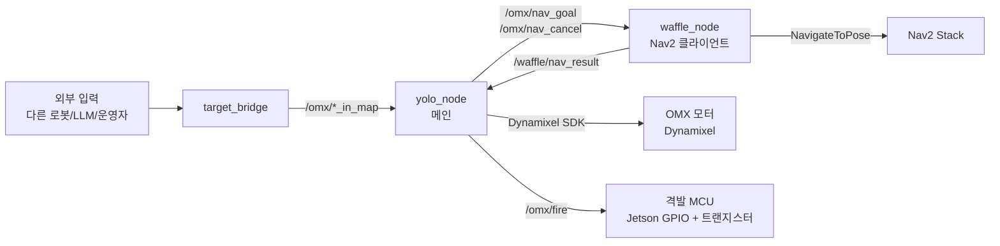
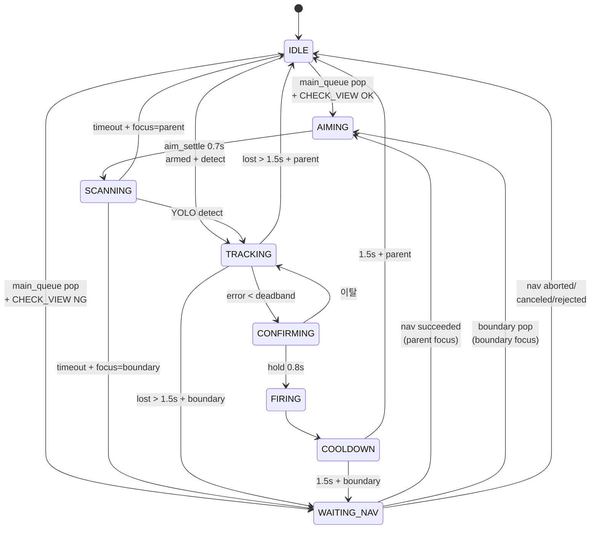

# OMX Auto-Aim System — INTERFACE v4

> Stage H5 + R6 (모듈 분리 완료) 기준.
>
> 변경 이력:
> - v1 (Stage F): 큐 + LOS + TargetType
> - v2 (Stage H1): waffle_node 분리, Nav2 협력 추가
> - v3 (Stage H3): 큐 분리, CHECK_VIEW/VIEW_POSE v1, WAITING_NAV, TARGET preempt
> - **v4 (Stage H5 + R6, 현재)**: VIEW_POSE v2 (후보 샘플링), BoundaryGenerator 통합, 코드 모듈 분리

---

## 1. 시스템 개요

### 노드 구성



### 책임 분할

| 노드 | 책임 |
|---|---|
| **yolo_node** | YOLO 검출, OMX 모터 제어, 큐 관리, state machine, CHECK_VIEW/VIEW_POSE 계산, 격발 신호 |
| **waffle_node** | Nav2 NavigateToPose action 클라이언트 (thin adapter), goal/cancel 명령 처리, 결과 전달 |
| **target_bridge** | 외부 좌표 입력 → 적절한 토픽으로 전달 |
| **격발 MCU (예정)** | `/omx/fire` 신호 수신 → GPIO → 트랜지스터 → 발사 메커니즘 |

### 코드 모듈 구조 (R6 완료)

```
~/omx_aim/
├── config.yaml
├── INTERFACE_v4.md
├── README.md
├── omx/                      # 패키지 (ROS 의존성 분리)
│   ├── __init__.py
│   ├── config.py             # dataclass + load_config
│   ├── hardware.py           # 저수준 Dynamixel
│   ├── types.py              # State, TargetType, LOSResult, TargetEntry
│   ├── state_machine.py      # StateMachine (큐 + 상태 머신)
│   ├── boundary_gen.py       # BoundaryGenerator (사주 경계)
│   ├── yolo_detector.py      # YoloDetector (cv2 + YOLO)
│   └── controller.py         # OmxController (Dynamixel + IBVS)
├── apps/                     # ROS 노드 진입점
│   ├── yolo_node.py          # OmxYoloNode 메인 노드
│   ├── waffle_node.py        # Nav2 클라이언트
│   ├── target_bridge.py
│   ├── keyboard_teleop.py
│   ├── aim_test.py
│   └── track_test.py
└── models/
    └── best.pt
```

### 좌표계

| Frame | 의미 |
|---|---|
| `map` | 전역 좌표계 (Nav2/SLAM 기준) |
| `base_link` | 와플의 base 위치 |
| `arm_base` | OMX 의 shoulder_pan 회전 중심 (base_link 기준 offset: x=0.10, y=0, z=0.18) |

모든 외부 좌표 입력은 `map` frame. yolo_node 내부에서 `arm_base` 기준으로 변환해서 OMX 에 명령.

---

## 2. ROS Topics

### 2.1 yolo_node 의 Subscribers

| Topic | Type | 발행자 | 의미 |
|---|---|---|---|
| `/omx/target_in_map` | `geometry_msgs/PointStamped` | 외부 | TARGET 좌표 (priority=0, 최우선) |
| `/omx/boundary_in_map` | `geometry_msgs/PointStamped` | 외부 (디버그) | BOUNDARY 좌표 (H4 부터는 내부 자동 생성도) |
| `/omx/patrol_in_map` | `geometry_msgs/PointStamped` | 외부 | PATROL 좌표 (priority=10, 탐색용) |
| `/omx/control_mode` | `std_msgs/String` | 외부 | `"idle"` 시 abort + home |
| `/omx/arm_enable` | `std_msgs/Bool` | 외부 | autotrack 활성화 (큐 비었을 때 YOLO 자동 추적) |
| `/omx/abort` | `std_msgs/Empty` | 외부 | 긴급 정지 |
| `/omx/boundary_enable` | `std_msgs/String` | 외부 (H4) | BOUNDARY 자동 생성 런타임 토글 |
| `/global_costmap/costmap` | `nav_msgs/OccupancyGrid` | Nav2 | LOS 검사 + VIEW_POSE v2 후보 평가 |
| `/waffle/nav_result` | `std_msgs/String` | waffle_node | Nav2 결과 |

### 2.2 yolo_node 의 Publishers

#### 외부 통신

| Topic | Type | 발행 시점 | 의미 |
|---|---|---|---|
| `/omx/fire` | `std_msgs/Empty` | FIRING 진입 | **격발 신호 → MCU** |
| `/omx/target_processed` | `geometry_msgs/PointStamped` | 격발 후 | 처리 완료 |
| `/omx/target_lost` | `geometry_msgs/PointStamped` | TRACKING lost timeout | 추적 중 잃음 |
| `/omx/target_not_found` | `geometry_msgs/PointStamped` | SCANNING timeout (TARGET) | TARGET 못 발견 |
| `/omx/target_blocked` | `geometry_msgs/PointStamped` | LOS BLOCKED 폐기 | 장애물 뒤 |
| `/omx/patrol_complete` | `std_msgs/Empty` | main_queue 비었을 때 1회 | 정찰 완료 |
| `/omx/nav_goal` | `geometry_msgs/PoseStamped` | WAITING_NAV 진입 | **waffle 이동 목표** |
| `/omx/nav_cancel` | `std_msgs/Empty` | TARGET preempt | waffle cancel 요청 |

#### 상태/디버그

| Topic | Type | 발행 빈도 | 의미 |
|---|---|---|---|
| `/omx/status` | `std_msgs/String` | 1 Hz | 상태 텍스트 |
| `/omx/state` | `std_msgs/String` | on change | state machine state |
| `/omx/target_detected` | `std_msgs/Bool` | every tick | YOLO 검출 여부 |
| `/omx/error_norm` | `geometry_msgs/Point` | every tick | 정규화 오차 |
| `/omx/joint_state` | `sensor_msgs/JointState` | every tick | OMX 관절 |
| `/omx/aim_progress` | `std_msgs/Float32` | every tick | CONFIRMING 진행도 |
| `/omx/queue_size` | `std_msgs/Int32` | 1 Hz | 큐 합계 |
| `/omx/queue_markers` | `visualization_msgs/MarkerArray` | 1 Hz | RViz 큐 |

### 2.3 waffle_node

| 방향 | Topic | Type |
|---|---|---|
| Sub | `/omx/nav_goal` | `PoseStamped` |
| Sub | `/omx/nav_cancel` | `Empty` |
| Pub | `/waffle/nav_result` | `String` (`succeeded`/`aborted`/`canceled`/`rejected`) |
| Pub | `/waffle/status` | `String` (1 Hz) |
| Pub | `/waffle/state` | `String` (on change) |
| Action | `/navigate_to_pose` | `nav2_msgs/NavigateToPose` |

### 2.4 `/omx/boundary_enable` 메시지 형식

`std_msgs/String` 으로 다음 중 하나:

| data | 의미 |
|---|---|
| `"target on"` / `"target off"` | TARGET 처리 중 BOUNDARY 토글 |
| `"patrol on"` / `"patrol off"` | PATROL 처리 중 BOUNDARY 토글 |
| `"all on"` / `"all off"` | 둘 다 토글 |

---

## 3. State Machine

### 3.1 State 정의

| State | 의미 | 진입 조건 | 종료 조건 |
|---|---|---|---|
| `IDLE` | 대기. 다음 작업 pop 시도 | 처리 끝, abort | main_queue pop / autotrack detect |
| `WAITING_NAV` | 와플 이동 중 | CHECK_VIEW NG 후 nav_goal 발행 | nav_result / preempt |
| `AIMING` | OMX 가 목표 각도로 이동 중 | 좌표 pop, view_pose 도착 | `aim_settle_sec` (0.7s) |
| `SCANNING` | 표적 발견 대기 | AIMING 종료 | YOLO detect / timeout |
| `TRACKING` | 표적 추적 (IBVS) | SCANNING 중 detect | error<deadband / lost timeout |
| `CONFIRMING` | 격발 직전 조준 유지 | TRACKING 정렬됨 | hold_time (0.8s) / 이탈 |
| `FIRING` | 격발 신호 | CONFIRMING hold | 즉시 |
| `COOLDOWN` | 격발 후 휴지 | FIRING | `cooldown_sec` (1.5s) |

### 3.2 전이 다이어그램



### 3.3 `current_parent` vs `current_focus`

- **`current_parent`**: 처리 중 TARGET/PATROL (와플 이동의 최종 목적지)
- **`current_focus`**: 지금 OMX 가 조준 중인 entry (parent 또는 boundary)

`_on_focus_done()` 판정:
- `focus == parent` → IDLE (parent 완료)
- `focus.type == BOUNDARY` → WAITING_NAV 복귀

### 3.4 `nav_pending_result` 처리

waffle 의 nav_result 는 비동기. 처리 우선순위:

1. **`pending_cancel_for_preempt = True`** → 무시 (preempt cancel 잔재)
2. **`state == WAITING_NAV`** → 즉시 적용
3. **그 외** → 큐 보관 (boundary 처리 끝나면 자동 적용)
4. **새 `nav_goal` 발행** → 옛 결과 자동 폐기 (race 방지)

---

## 4. Queue Policy

### 4.1 큐 분리

| 큐 | 담는 type | 정렬 | 처리 시점 |
|---|---|---|---|
| `main_queue` | TARGET (priority 0), PATROL (priority 10) | (priority, distance, count) | IDLE pop |
| `boundary_queue` | BOUNDARY (priority 5) | (priority, distance, count) | WAITING_NAV pop |

### 4.2 중복 검사

**같은 type 끼리만** 중복 (PATROL → TARGET 업그레이드 허용).

| 입력 | 비교 대상 |
|---|---|
| BOUNDARY | `boundary_queue` 안 BOUNDARY 끼리만 |
| PATROL | `last_processed` + `main_queue` PATROL + `current_parent` PATROL |
| TARGET | `main_queue` TARGET + `current_parent` TARGET (last_processed 무시) |

threshold: `patrol.duplicate_threshold_m` (기본 0.3m)

### 4.3 TARGET preempt

TARGET 도착 흐름:
```
on_target(coord):
  1. _upgrade_patrol_in_queue_to_target(coord)  # 같은 위치 PATROL 제거
  2. add_target(coord, TARGET)
  3. _maybe_preempt_for_target(coord)
```

**Preempt 조건** (`_preempt_ok`):
- `current_parent.type == PATROL`
- `state ∈ {WAITING_NAV, AIMING, SCANNING}`
- (TRACKING/CONFIRMING/FIRING/COOLDOWN 은 끝까지)

**위치별 분기**:

| 위치 관계 | 동작 |
|---|---|
| **같은 위치** | PATROL 폐기 (업그레이드) |
| **다른 위치** | PATROL `main_queue` 재push (priority 로 자동 재정렬) |

와플 이동 중이면 `/omx/nav_cancel` 발행. cancel 결과는 `pending_cancel_for_preempt` 로 무시.

### 4.4 CHECK_VIEW

PATROL/TARGET 좌표를 *현 와플 위치에서* 조준 가능?

3 조건 모두 통과:
1. LOS ∈ {CLEAR, UNKNOWN} (BLOCKED 불가)
2. arm_base 기준 yaw ≤ `view_pose.omx_yaw_limit_deg` (기본 180°)
3. arm_base 기준 거리 ∈ `[min_distance_m, max_distance_m]` (기본 [0.3, 3.0]m)

OK → AIMING. NG → VIEW_POSE 계산 → WAITING_NAV.

### 4.5 VIEW_POSE v2 (H5)

`target_map` 주변 `candidate_count` (12) 방향에서 `stand_off_distance` 떨어진 후보 생성:
```
for i in range(N):
    angle = 2π * i / N
    cx = target.x + stand_off * cos(angle)
    cy = target.y + stand_off * sin(angle)
```

**필수 조건 3개** (모두 통과해야 valid):
1. `costmap_value < 80` (벽/inflation 회피)
2. LOS from candidate to target ≠ BLOCKED
3. OMX 가 final_yaw 에서 target 조준 가능 (yaw_limit 안)

**Cost 함수** (낮을수록 좋음, 코드 안 상수):
```
cost = W_INFL * (costmap_value / 100)              # 벽 가까움 penalty
     + W_DIST * |distance_to_target - stand_off|    # 이상 거리 편차
     + W_WAFL * distance_from_waffle                # 이동 시간

W_INFL = 1.0, W_DIST = 2.0, W_WAFL = 0.5
```

최소 cost 선택. **모두 부적합 → None 반환 → parent 폐기**.

### 4.6 VIEW_POSE yaw 정책 (H5)

target 방향과 next_target_map 방향의 **짧은 경로 보간**:
```
yaw_target = atan2(target - candidate)
if next_target:
    yaw_next = atan2(next_target - candidate)
    diff = ((yaw_next - yaw_target + π) % 2π) - π   # [-π, π]
    final_yaw = yaw_target + yaw_next_weight * diff
else:
    final_yaw = yaw_target
```

`yaw_next_weight` (기본 0.5):
- 0.0: target 100% (OMX 정면, 와플은 다음 작업 시 큰 회전)
- 0.5: 중간 (OMX, 와플 균등 부담) ← 기본
- 1.0: next 100% (와플이 다음 방향, OMX ±180° 회전)

운영 중 `config.yaml` 로 조정.

### 4.7 LOS Pop

큐 pop 시 LOS 검사:

| LOS 결과 | PATROL/TARGET | BOUNDARY |
|---|---|---|
| CLEAR | 반환 | 반환 |
| UNKNOWN | 반환 | 폐기 |
| BLOCKED | 반환 | 폐기 (target_blocked 발행) |

### 4.8 BOUNDARY 정책

#### 자동 생성 (H4)

`BoundaryGenerator` 가 WAITING_NAV 중 PATROL parent 처리할 때 sweep 으로 생성:
- 와플 heading 기준 ±`fan_half_angle_deg` (45°) 범위
- `angle_step_deg` (22.5°) 간격으로 sweep
- 매 `period_sec` (2.5s) 마다 1개

```
sweep_angles = [-45, -22.5, 0, +22.5, +45]
매 2.5초마다 한 칸씩 (-45 → -22.5 → 0 → +22.5 → +45 → -45 → ...)
```

`enable_during_target=false` (기본): TARGET 처리 중에는 BOUNDARY 생성 안 함.

#### TTL 자동 폐기

`boundary.ttl_sec` (10s) 초과한 BOUNDARY 는 pop 시점에 자동 폐기:
```
BOUNDARY TTL 초과 (10.3s > 10.0s) 폐기: (x, y, z)
```

#### 일괄 clear 트리거

- `nav_result = succeeded` (와플 도착)
- `nav_result = aborted/canceled/rejected`
- TARGET preempt
- abort

---

## 5. Config Reference

`config.yaml` 의 모든 섹션.

### 5.1 `motor`

```yaml
motor:
  port: /dev/ttyUSB0
  profile_velocity: 50
  profile_acceleration: 20
```

### 5.2 `calibration`

```yaml
calibration:
  home: { shoulder_pan: 2048, shoulder_lift: 2048, elbow_flex: 2048, wrist_flex: 2048 }
  sign: { shoulder_pan: 1, shoulder_lift: -1, elbow_flex: 1, wrist_flex: 1 }
```

> wrist_roll, gripper 는 H2 부터 물리적 제거.

### 5.3 `safety`

```yaml
safety:
  angle_limits_deg:
    shoulder_pan:  [-180, 180]   # H2: VIEW_POSE next 방향 정책 위해 ±180
    shoulder_lift: [-60,  60]
    elbow_flex:    [-90,  90]
    wrist_flex:    [-90,  90]
  max_step_deg: 2.0
  large_delta_threshold_tick: 500
```

### 5.4 `ibvs`

```yaml
ibvs:
  camera_index: 0
  control_hz: 30
  deadband: 0.05
  kp_yaw: 0.3
  kp_pitch: 0.3
  sign_vs_x: 1
  sign_vs_y: -1
```

### 5.5 `yolo`

```yaml
yolo:
  model_path: /home/lyw/omx_aim/models/best.pt
  target_class: 0
  conf_threshold: 0.5
  imgsz: 640
```

### 5.6 `fire`

```yaml
fire:
  hold_time_sec: 0.8
  cooldown_sec: 1.5
  lost_timeout_sec: 1.5
  confirm_deadband_scale: 0.5
  aim_settle_sec: 0.7              # H2.1: AIMING 대기 시간
```

### 5.7 `autotrack`

```yaml
autotrack:
  default_armed: false
```

### 5.8 `patrol`

```yaml
patrol:
  scan_timeout_sec: 2.0
  target_scan_timeout_sec: 5.0       # H3: TARGET 더 길게
  boundary_scan_timeout_sec: 1.0     # H4: BOUNDARY 짧게
  duplicate_threshold_m: 0.3
  los_check_enabled: true
  los_cost_threshold: 50
  costmap_topic: /global_costmap/costmap
  publish_queue_markers: true
  max_queue_size: 20
```

### 5.9 `waffle`

```yaml
waffle:
  frame: map
  nav_action_name: /navigate_to_pose
```

### 5.10 `view_pose` (H2 + H5)

```yaml
view_pose:
  omx_yaw_limit_deg: 180.0           # CHECK_VIEW 의 yaw 한계
  min_distance_m: 0.3                # CHECK_VIEW 의 거리 하한
  max_distance_m: 3.0                # 거리 상한
  stand_off_distance: 1.0            # 후보 생성 시 target 으로부터 거리
  candidate_count: 12                # H5: 후보 방향 수
  yaw_next_weight: 0.5               # H5: 0=target, 1=next, 0.5=중간
```

### 5.11 `boundary` (H4)

```yaml
boundary:
  enable_during_target: false
  enable_during_patrol: true
  fan_half_angle_deg: 45.0
  angle_step_deg: 22.5
  distance_m: 1.5
  z: 0.3
  period_sec: 2.5                    # H4 튜닝: 1.0 → 2.5
  max_queue_size: 10
  ttl_sec: 10.0
```

---

## 7. 운영 시나리오

### 7.1 단순 PATROL — CHECK_VIEW OK

```bash
ros2 topic pub /omx/patrol_in_map geometry_msgs/PointStamped \
  "{header: {frame_id: map}, point: {x: 1.0, y: 0.0, z: 0.3}}" --once
```

흐름: `IDLE → AIMING (0.7s) → SCANNING (2s) → IDLE`

### 7.2 PATROL — CHECK_VIEW NG → VIEW_POSE v2

```bash
ros2 topic pub /omx/patrol_in_map geometry_msgs/PointStamped \
  "{header: {frame_id: map}, point: {x: 5.0, y: 3.0, z: 0.3}}" --once
```

기대 로그:
```
CHECK_VIEW NG: LOS BLOCKED (또는 yaw out / dist out)
VIEW_POSE v2: 12개 중 N 적합, 선택 cost=X.XX (infl=Y, dist_waffle=Z.ZZm)
[nav_goal] 발행
... 시간 흐름 ...
nav_result 받음: succeeded
와플 도착, parent AIMING
```

### 7.3 TARGET 업그레이드 — 같은 위치

```bash
ros2 topic pub /omx/patrol_in_map geometry_msgs/PointStamped \
  "{header: {frame_id: map}, point: {x: 3.0, y: 1.0, z: 0.0}}" --once
sleep 1
ros2 topic pub /omx/target_in_map geometry_msgs/PointStamped \
  "{header: {frame_id: map}, point: {x: 3.0, y: 1.0, z: 0.0}}" --once
```

```
=== TARGET preempt 발동 (state=waiting_nav, parent_loc=same) ===
PATROL → TARGET 업그레이드: (3.0, 1.0, 0.0) 폐기
```

### 7.4 TARGET preempt — 다른 위치, PATROL 큐 복귀

```bash
ros2 topic pub /omx/patrol_in_map geometry_msgs/PointStamped \
  "{header: {frame_id: map}, point: {x: 3.0, y: 0.0, z: 0.0}}" --once
sleep 1
ros2 topic pub /omx/target_in_map geometry_msgs/PointStamped \
  "{header: {frame_id: map}, point: {x: 1.0, y: -1.0, z: 0.3}}" --once
```

```
=== TARGET preempt 발동 (state=..., parent_loc=different) ===
PATROL 큐 복귀: (3.0, 0.0, 0.0)
... TARGET 처리 ...
main_queue pop: PATROL (3.0, 0.0, 0.0)
```

### 7.5 TARGET miss

```bash
ros2 topic pub /omx/target_in_map geometry_msgs/PointStamped \
  "{header: {frame_id: map}, point: {x: 1.0, y: 0.0, z: 0.3}}" --once

ros2 topic echo /omx/target_not_found
```

5초 (`target_scan_timeout_sec`) 후 `target_not_found` 발행.

### 7.6 TRACKING 중 TARGET (preempt 안 함)

`TARGET preempt 발동` 로그 안 찍힘 (TRACKING state 제외 정책).

### 7.7 BOUNDARY 자동 sweep (H4)

WAITING_NAV + PATROL parent 일 때 `BoundaryGenerator` 가 매 2.5초 BOUNDARY 1개 생성:
```
큐 추가: type=BOUNDARY coord=(...) ...
```

토글:
```bash
ros2 topic pub /omx/boundary_enable std_msgs/String "{data: 'all off'}" --once
```

### 7.8 abort

```bash
ros2 topic pub /omx/abort std_msgs/Empty "{}" --once
```

state → IDLE, 모든 큐 비움, OMX home 복귀, race flag reset.

---

## 부록 A. 미구현 / 로드맵

| 단계 | 내용 | 상태 |
|---|---|---|
| H6 | (선택) parent_id 추적 활용, view_pose v3 (다중 거리 후보) | 미정 |
| — | 격발 MCU 펌웨어 (Jetson GPIO + 트랜지스터) | 외부 트랙 |
| — | LLM 명령 해석 | 외부 트랙 |
| — | 다중 로봇 협력 (Burger SLAM + 보급 로봇) | 외부 트랙 |

## 부록 B. 모듈 책임 요약

| 파일 | 책임 | 줄 수 |
|---|---|---|
| `omx/types.py` | enums + TargetEntry dataclass | 115 |
| `omx/state_machine.py` | StateMachine (큐 + state 전이 + preempt) | 700 |
| `omx/boundary_gen.py` | BoundaryGenerator (sweep) | 105 |
| `omx/yolo_detector.py` | YoloDetector (cv2 + YOLO) | 93 |
| `omx/controller.py` | OmxController (Dynamixel + IBVS) | 216 |
| `omx/config.py` | dataclass + load_config | (기존) |
| `omx/hardware.py` | 저수준 DXL bus | (기존) |
| `apps/yolo_node.py` | OmxYoloNode 메인 (ROS pub/sub + 시각화) | 1072 |
| `apps/waffle_node.py` | Nav2 클라이언트 (thin adapter) | 336 |

## 부록 C. 콜백 주입 패턴 (StateMachine 의 ROS 분리)

`OmxYoloNode.__init__` 에서 `StateMachine` 인스턴스 생성 후 콜백 주입:

```python
self.sm.los_check_fn = self.check_line_of_sight
self.sm.waffle_pos_fn = self.get_waffle_xy
self.sm.check_view_fn = self.check_view
self.sm.compute_view_pose_fn = self.compute_view_pose
self.sm.nav_cancel_fn = self.publish_nav_cancel
```

`StateMachine` 본체는 ROS 의존성 없음. 단위 테스트 가능.