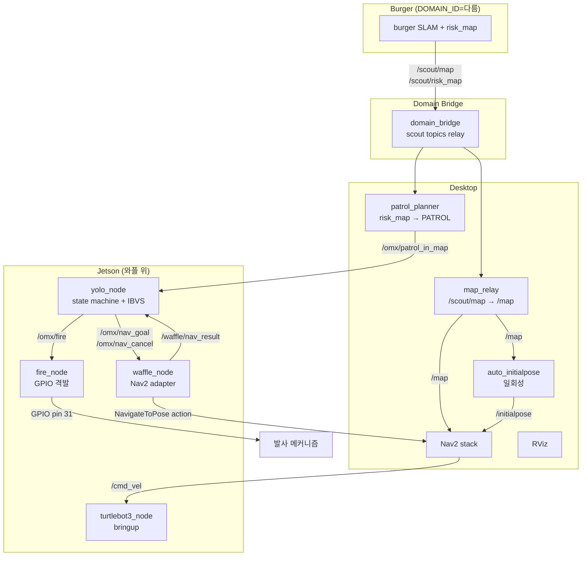
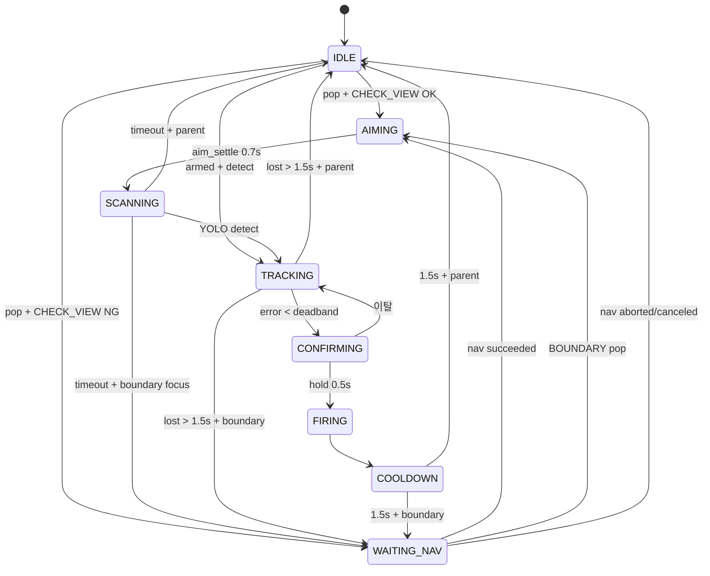

# OMX Auto-Aim System — INTERFACE v5

> Stage H5 + R6 + Burger 통합 + 격발 MCU 기준.
>
> 변경 이력:
> - v1 (Stage F): 큐 + LOS + TargetType
> - v2 (Stage H1): waffle_node 분리, Nav2 협력 추가
> - v3 (Stage H3): 큐 분리, CHECK_VIEW/VIEW_POSE v1, WAITING_NAV, TARGET preempt
> - v4 (Stage H5 + R6): VIEW_POSE v2 (후보 샘플링), BoundaryGenerator, 모듈 분리
> - **v5 (현재)**: Burger 통합 (map_relay + patrol_planner + decay), fire_node, 2D 운영 모드, deadband 비대칭 분리, motor sign 보정

---

## 1. 전체 시스템 구성

### 노드 토폴로지



### 책임 분할

| 노드 | 책임 | 위치 |
|---|---|---|
| **yolo_node** | YOLO 검출, OMX 제어, 큐 관리, state machine, CHECK_VIEW/VIEW_POSE | Jetson |
| **waffle_node** | Nav2 NavigateToPose action 어댑터 | Jetson |
| **fire_node** | `/omx/fire` 수신 → GPIO 펄스 → 격발 메커니즘 | Jetson |
| **target_bridge** | 외부 좌표 입력 통합 | Jetson |
| **map_relay** | `/scout/map` → `/map` relay (latched) | Desktop |
| **patrol_planner** | risk_map 분석 + decay + PATROL 발행 | Desktop |
| **auto_initialpose** | map 수신 시 `/initialpose` 자동 발행 | Desktop |
| **domain_bridge** | Burger ↔ 우리 시스템 도메인 통신 | Desktop |
| **Nav2 stack** | 경로 계획 + 모터 명령 | Desktop |
| **turtlebot3_node** | 와플 하드웨어 통신 (모터, 센서) | Jetson |

### 코드 모듈 구조

```
~/omx_aim/
├── config.yaml
├── INTERFACE_v5.md
├── README.md
├── omx/                      # 핵심 로직 (ROS 의존성 없음)
│   ├── __init__.py
│   ├── config.py             # dataclass + load_config
│   ├── hardware.py           # 저수준 Dynamixel
│   ├── types.py              # State, TargetType, LOSResult, TargetEntry
│   ├── state_machine.py      # StateMachine
│   ├── boundary_gen.py       # BoundaryGenerator
│   ├── yolo_detector.py      # YoloDetector
│   └── controller.py         # OmxController
├── apps/                     # ROS 노드
│   ├── yolo_node.py          # OmxYoloNode 메인
│   ├── waffle_node.py        # Nav2 클라이언트
│   ├── target_bridge.py      # 외부 좌표 통합
│   ├── fire_node.py          # GPIO 격발 (신규)
│   ├── map_relay.py          # Burger map relay (신규)
│   ├── patrol_planner.py     # risk_map → PATROL (신규)
│   ├── auto_initialpose.py   # 자동 initial pose (신규)
│   ├── fake_risk_map.py      # Burger risk_map 시뮬 (신규)
│   ├── fake_static_map.py    # Burger map 시뮬 (신규)
│   ├── keyboard_teleop.py
│   ├── aim_test.py
│   └── track_test.py
├── configs/
│   └── scout_bridge.yaml     # domain_bridge 설정 (신규)
└── models/
    └── best.pt
```

---

## 2. ROS Topics

### 2.1 Burger 시스템 (외부)

| Topic | Type | 의미 |
|---|---|---|
| `/scout/map` | `nav_msgs/OccupancyGrid` | Burger SLAM 맵 |
| `/scout/risk_map` | `nav_msgs/OccupancyGrid` | 위험도 (0~100) |

### 2.2 Desktop 처리

| Topic | Type | 발행자 | 의미 |
|---|---|---|---|
| `/map` | `OccupancyGrid` | map_relay | Nav2 입력 |
| `/initialpose` | `PoseWithCovarianceStamped` | auto_initialpose | AMCL 초기화 |
| `/omx/patrol_in_map` | `PointStamped` | patrol_planner | PATROL 좌표 |
| `/patrol_planner/markers` | `MarkerArray` | patrol_planner | RViz 시각화 |

### 2.3 yolo_node Subscribers

| Topic | Type | 의미 |
|---|---|---|
| `/omx/target_in_map` | `PointStamped` | TARGET 좌표 (priority=0) |
| `/omx/boundary_in_map` | `PointStamped` | BOUNDARY (디버그용) |
| `/omx/patrol_in_map` | `PointStamped` | PATROL 좌표 (priority=10) |
| `/omx/control_mode` | `String` | `"idle"` 시 abort + home |
| `/omx/arm_enable` | `Bool` | autotrack 활성화 |
| `/omx/abort` | `Empty` | 긴급 정지 |
| `/omx/boundary_enable` | `String` | BOUNDARY 자동 생성 토글 |
| `/global_costmap/costmap` | `OccupancyGrid` | LOS + VIEW_POSE v2 |
| `/waffle/nav_result` | `String` | Nav2 결과 |

### 2.4 yolo_node Publishers

#### 외부 통신

| Topic | Type | 의미 |
|---|---|---|
| `/omx/fire` | `Empty` | **격발 신호 → fire_node** |
| `/omx/target_processed` | `PointStamped` | 처리 완료 (patrol_planner 가 decay) |
| `/omx/target_lost` | `PointStamped` | TRACKING lost |
| `/omx/target_not_found` | `PointStamped` | TARGET SCANNING timeout |
| `/omx/target_blocked` | `PointStamped` | LOS BLOCKED 폐기 |
| `/omx/patrol_complete` | `Empty` | main_queue 비었음 |
| `/omx/nav_goal` | `PoseStamped` | **waffle 이동 목표** |
| `/omx/nav_cancel` | `Empty` | waffle cancel |

#### 상태/디버그

| Topic | Type | 주기 | 의미 |
|---|---|---|---|
| `/omx/status` | `String` | 1 Hz | 상태 텍스트 |
| `/omx/state` | `String` | on change | state machine |
| `/omx/target_detected` | `Bool` | 25Hz | YOLO 검출 |
| `/omx/error_norm` | `Point` | 25Hz | 정규화 오차 |
| `/omx/joint_state` | `JointState` | 25Hz | OMX 관절 |
| `/omx/aim_progress` | `Float32` | 25Hz | CONFIRMING 진행 |
| `/omx/queue_size` | `Int32` | 1 Hz | 큐 합계 |
| `/omx/queue_markers` | `MarkerArray` | 1 Hz | RViz 큐 |

### 2.5 fire_node

| 방향 | Topic | Type | 의미 |
|---|---|---|---|
| Sub | `/omx/fire` | `Empty` | 격발 신호 |
| Sub | `/omx/fire_disable` | `Bool` | true 면 격발 무시 |
| Pub | `/omx/fire_status` | `String` | armed/firing/cooldown/disabled |

### 2.6 waffle_node

| 방향 | Topic / Action | Type |
|---|---|---|
| Sub | `/omx/nav_goal` | `PoseStamped` |
| Sub | `/omx/nav_cancel` | `Empty` |
| Pub | `/waffle/nav_result` | `String` |
| Pub | `/waffle/status` | `String` (1 Hz) |
| Action | `/navigate_to_pose` | `nav2_msgs/NavigateToPose` |

---

## 3. State Machine

### 3.1 State 정의

| State | 의미 | 다음 |
|---|---|---|
| `IDLE` | 대기, 다음 좌표 pop | AIMING / WAITING_NAV |
| `WAITING_NAV` | 와플 이동 중 | AIMING (nav succeeded) |
| `AIMING` | OMX coarse 조준 (0.7s) | SCANNING |
| `SCANNING` | YOLO 검출 대기 | TRACKING / IDLE / WAITING_NAV |
| `TRACKING` | IBVS 추적 | CONFIRMING / IDLE / WAITING_NAV |
| `CONFIRMING` | hold time (0.5s) | FIRING / TRACKING |
| `FIRING` | 격발 신호 | COOLDOWN |
| `COOLDOWN` | 1.5s 휴지 | IDLE / WAITING_NAV |

### 3.2 전이 다이어그램



---

## 4. 큐 정책

### 4.1 큐 분리

| 큐 | type | 정렬 | pop 시점 |
|---|---|---|---|
| `main_queue` | TARGET (0), PATROL (10) | (priority, distance, count) | IDLE |
| `boundary_queue` | BOUNDARY (5) | (priority, distance, count) | WAITING_NAV |

### 4.2 TARGET preempt

| 위치 관계 | 동작 |
|---|---|
| 같은 위치 PATROL | PATROL 폐기 (업그레이드) |
| 다른 위치 PATROL | main_queue 재push |

### 4.3 CHECK_VIEW

3 조건:
1. LOS ∈ {CLEAR, UNKNOWN}
2. arm_base yaw ≤ omx_yaw_limit (180°)
3. arm_base 거리 ∈ [0.3, 3.0] m

### 4.4 VIEW_POSE v2

target 주변 12 방향 후보 (30° 간격):

**필수 조건**:
1. costmap_value < 80
2. LOS to target ≠ BLOCKED
3. OMX final_yaw 에서 target 조준 가능

**Cost**:
```
cost = 1.0 * (costmap/100)
     + 2.0 * |distance - 1.0|
     + 0.5 * distance_from_waffle
```

**yaw 정책**: `yaw_target + yaw_next_weight * (yaw_next - yaw_target)` (기본 0.5)

**모두 부적합** → parent 폐기.

### 4.5 BoundaryGenerator (H4)

- WAITING_NAV + PATROL parent
- ±45° fan, 22.5° step → `[-45, -22.5, 0, +22.5, +45]`
- 매 2.5s 한 칸 sweep
- TTL 10s

---

## 5. Patrol Planner (신규)

### 5.1 알고리즘

1. risk_map 의 각 셀에 **decay factor** 적용 → adjusted_risk
2. adjusted_risk >= 40 인 셀을 후보로
3. risk 내림차순 정렬
4. **NMS**: 이미 선택된 후보와 1.0m 이상 떨어진 것만
5. top 3 선택 → 발행

### 5.2 Decay (A+B 혼합)

| 종류 | 트리거 | factor | duration | recovery |
|---|---|---|---|---|
| **Publish decay** | PATROL 발행 시 | 0.4 (60% 감쇠) | 60s | 30s |
| **Processed decay** | `/omx/target_processed` 수신 | 0.1 (90% 감쇠) | 120s | 60s |

같은 위치 여러 event → **최솟값** 적용 (가장 강한 decay).

### 5.3 파라미터

```bash
ros2 run patrol_planner --ros-args \
  -p min_risk:=40 \
  -p min_distance_m:=1.0 \
  -p max_candidates_per_cycle:=3 \
  -p publish_period_sec:=10.0 \
  -p publish_decay_factor:=0.4 \
  -p publish_decay_duration_sec:=60.0
```

---

## 6. Fire Node (신규)

### 6.1 동작

`/omx/fire` 수신 → GPIO pin 31 을 0.7초 HIGH → LOW.

### 6.2 안전 기능

- 부팅 시 LOW (idle)
- 종료 시 LOW + cleanup
- cooldown 1.5s (연발 방지)
- `/omx/fire_disable` 토픽으로 잠금
- 별도 thread (콜백 블록 안 함)

### 6.3 파라미터

```yaml
pin: 31
fire_duration_sec: 0.7
cooldown_sec: 1.5
active_state: HIGH
start_disabled: false
```

---

## 7. Config Reference

### 7.1 motor

```yaml
motor:
  port: /dev/omx_follower
  profile_velocity: 30
  profile_acceleration: 10
```

### 7.2 calibration (motor sign 보정 완료)

```yaml
calibration:
  home:
    shoulder_pan:  2048
    shoulder_lift: 1055
    elbow_flex:    3050
    wrist_flex:    2048
  sign:
    shoulder_pan:  1
    shoulder_lift: -1     # ← 보정 (위/아래 정합)
    elbow_flex:    1
    wrist_flex:    1
```

### 7.3 safety

```yaml
safety:
  angle_limits_deg:
    shoulder_pan:  [-180, 180]
    shoulder_lift: [-30, 30]
  max_step_deg: 2.0
```

### 7.4 ibvs (deadband 비대칭)

```yaml
ibvs:
  camera_index: 0
  kp_yaw: 0.02
  kp_pitch: 0.02
  sign_vs_x: -1
  sign_vs_y: -1          # ← 보정
  deadband_x: 0.03       # 좌우 정밀
  deadband_y: 0.09       # 위아래 여유 (3배)
  control_hz: 25.0
```

### 7.5 yolo

```yaml
yolo:
  model_path: ../models/best.pt
  target_class: 1        # enemy
  conf_threshold: 0.5
  imgsz: 640
```

### 7.6 fire

```yaml
fire:
  hold_time_sec: 0.5
  confirm_deadband_scale: 1.0
  aim_settle_sec: 0.7
  cooldown_sec: 1.5
  lost_timeout_sec: 1.5
```

### 7.7 patrol

```yaml
patrol:
  scan_timeout_sec: 2.0
  target_scan_timeout_sec: 5.0
  boundary_scan_timeout_sec: 1.0
  los_cost_threshold: 80
  publish_queue_markers: true
```

### 7.8 view_pose (2D 운영)

```yaml
view_pose:
  omx_yaw_limit_deg: 180.0
  min_distance_m: 0.3
  max_distance_m: 3.0
  stand_off_distance: 1.0
  candidate_count: 12
  yaw_next_weight: 0.5
```

### 7.9 boundary

```yaml
boundary:
  enable_during_target: false
  enable_during_patrol: true
  fan_half_angle_deg: 45.0
  angle_step_deg: 22.5
  distance_m: 1.5
  z: 0.0                  # ← 2D 운영 (이전 0.18)
  period_sec: 2.0
  ttl_sec: 10.0
```

---

## 8. 운영 시나리오

### 8.1 정상 PATROL 처리

```bash
ros2 topic pub /omx/patrol_in_map geometry_msgs/PointStamped \
  "{header: {frame_id: map}, point: {x: 1.0, y: 0.0, z: 0.0}}" --once
```

`IDLE → AIMING → SCANNING → IDLE` (못 찾으면)
또는 `... → TRACKING → CONFIRMING → FIRING → COOLDOWN → IDLE`

### 8.2 TARGET preempt

```bash
# PATROL 처리 중
ros2 topic pub /omx/target_in_map geometry_msgs/PointStamped \
  "{header: {frame_id: map}, point: {x: 2.0, y: 1.0, z: 0.0}}" --once
```

PATROL 상태에 따라:
- same 위치: 업그레이드
- different: PATROL 큐 복귀 + TARGET 처리

### 8.3 자동 조준 토글

```bash
# ON
ros2 topic pub /omx/arm_enable std_msgs/Bool "{data: true}" --once

# OFF
ros2 topic pub /omx/arm_enable std_msgs/Bool "{data: false}" --once
```

### 8.4 긴급 정지

```bash
ros2 topic pub /omx/abort std_msgs/Empty "{}" --once
ros2 topic pub /omx/fire_disable std_msgs/Bool "{data: true}" --once
```

### 8.5 BOUNDARY 토글

```bash
ros2 topic pub /omx/boundary_enable std_msgs/String "{data: 'all off'}" --once
```

---

## 부록 A. 모듈 책임 + 줄 수

| 파일 | 책임 | 줄 수 |
|---|---|---|
| `omx/types.py` | enums + TargetEntry | 115 |
| `omx/state_machine.py` | StateMachine | 700 |
| `omx/boundary_gen.py` | BoundaryGenerator | 105 |
| `omx/yolo_detector.py` | YOLO + cv2 | 93 |
| `omx/controller.py` | OmxController + IBVS | 216 |
| `apps/yolo_node.py` | OmxYoloNode | ~1080 |
| `apps/waffle_node.py` | Nav2 어댑터 | 336 |
| `apps/fire_node.py` | GPIO 격발 | 259 |
| `apps/map_relay.py` | map relay | 85 |
| `apps/patrol_planner.py` | NMS + decay | 457 |
| `apps/auto_initialpose.py` | initial pose | 193 |
| `apps/fake_risk_map.py` | risk_map 시뮬 | 130 |
| `apps/fake_static_map.py` | map 시뮬 | 172 |

## 부록 B. 미해결 / 알려진 이슈

| 항목 | 영향 |
|---|---|
| `on_abort` 가 `nav_cancel` 발행 안 함 | abort 후 와플 계속 이동 (안전 이슈) |
| `boundary_scan_timeout_sec` 미적용 (실제로는 `scan_timeout_sec` 사용) | BOUNDARY 도 2초 대기 |
| OpenCR 의 battery_state present=false | voltage 0.05V 보고, 모터는 정상 |
| `/dev/tb3_lidar` udev 심볼릭 링크 없음 | Lidar bringup 시 ERROR |

## 부록 C. 콜백 주입 패턴

`OmxYoloNode.__init__` 에서:

```python
self.sm.los_check_fn = self.check_line_of_sight
self.sm.waffle_pos_fn = self.get_waffle_xy
self.sm.check_view_fn = self.check_view
self.sm.compute_view_pose_fn = self.compute_view_pose
self.sm.nav_cancel_fn = self.publish_nav_cancel
```

`StateMachine` 본체는 ROS 의존성 없음.