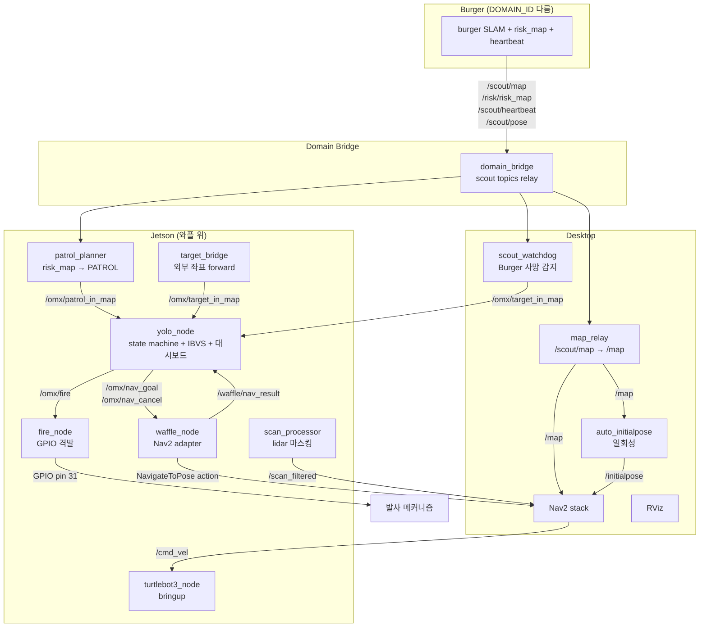
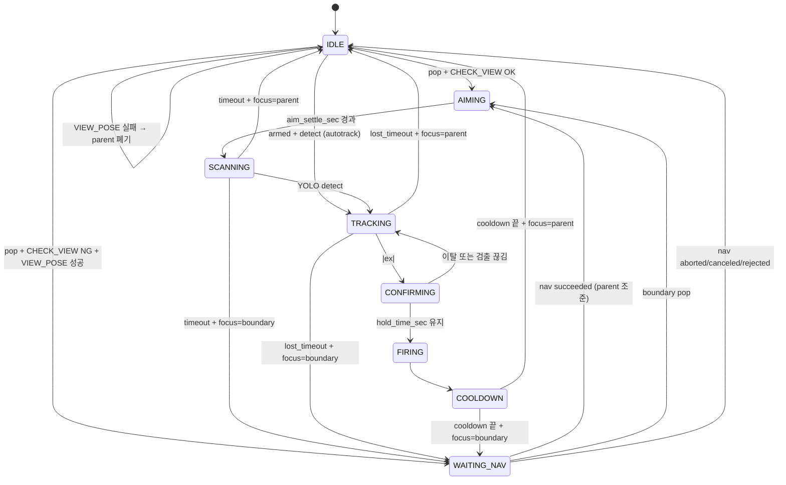

# OMX Auto-Aim System — INTERFACE v6

> 코드 기준일: 2026-07-24 / 기준 커밋: `4810692`
>
> 변경 이력:
> - v1 (Stage F): 큐 + LOS + TargetType
> - v2 (Stage H1): waffle_node 분리, Nav2 협력 추가
> - v3 (Stage H3): 큐 분리, CHECK_VIEW/VIEW_POSE v1, WAITING_NAV, TARGET preempt
> - v4 (Stage H5 + R6): VIEW_POSE v2 (후보 샘플링), BoundaryGenerator, 모듈 분리
> - v5: Burger 통합 (map_relay + patrol_planner + decay), fire_node, 2D 운영 모드
> - **v6 (현재)**: 코드 전면 대조 후 재작성. 디버그 대시보드 / odom_calib 문서화, patrol decay 제거 반영, config 값 중복 제거, 부록 B 갱신

---

## 0. 문서 역할 분담

값이 문서와 코드 양쪽에 적혀 있으면 반드시 어긋난다. v6부터 아래 규칙을 지킨다.

| 문서 | 역할 | 값을 적는가 |
|---|---|---|
| `README.md` | 무엇을 하는 시스템인지 + 5분 안에 실행 | ✗ (명령어만) |
| `INTERFACE.md` | 계약서. 토픽 / 상태 / 큐 / 파라미터 **키와 의미** | ✗ (제약 관계만) |
| `SETUP.md` | 설치 · 하드웨어 · 트러블슈팅 | ✓ (환경 버전) |
| `config/config.yaml` | **모든 런타임 값의 단일 출처** | ✓ |

§7은 "이 키가 뭘 하는가"만 설명한다. 실제 숫자는 `config.yaml`에서 확인할 것.

---

## 1. 전체 시스템 구성

### 1.1 노드 토폴로지



> ⚠️ **patrol_planner 실행 위치 미확정**: 현재 `desktop.launch.py`와 `jetson.launch.py` **양쪽 모두**에 들어있다. 둘 다 켜면 PATROL 좌표가 이중 발행된다. 한쪽을 주석 처리할 것 (부록 B-1).

### 1.2 책임 분할

| 노드 | 책임 | 실행 위치 | launch |
|---|---|---|---|
| **yolo_node** | YOLO 검출, OMX 제어, 큐, state machine, CHECK_VIEW/VIEW_POSE, 디버그 대시보드 | Jetson | jetson |
| **waffle_node** | Nav2 NavigateToPose action 어댑터 | Jetson | jetson |
| **fire_node** | `/omx/fire` → GPIO 펄스 | Jetson | jetson |
| **target_bridge** | 외부 좌표 / RViz 클릭 forward | Jetson | jetson |
| **scan_processor** | lidar 180° flip + 자기구조물 마스킹 | Jetson | jetson |
| **patrol_planner** | risk_map hotspot → PATROL 발행 | ⚠️ 미확정 | jetson + desktop |
| **map_relay** | `/scout/map` → `/map` (latched) | Desktop | desktop (주석) |
| **auto_initialpose** | map 수신 시 `/initialpose` 자동 발행 | Desktop | desktop (주석) |
| **scout_watchdog** | Burger heartbeat 감시 + 수색 TARGET 발행 | Desktop | desktop (주석) |
| **domain_bridge** | Burger ↔ 우리 시스템 도메인 통신 | Desktop | 수동 |
| **Nav2 stack** | 경로 계획 + 모터 명령 | Desktop | 수동 |
| **turtlebot3_node** | 와플 하드웨어 통신 | Jetson | 수동 |

**비-ROS CLI 도구** (`ros2 run` 으로 실행하지만 노드가 아니거나 단독 실행)

| 도구 | 용도 |
|---|---|
| `odom_calib` | 궤도 드라이브트레인 오도메트리 실측 보정 (§10) |
| `ik_teleop` | 좌표 조준 IK 인터랙티브 CLI |
| `scan_diag` | lidar 진단 |
| `fake_static_map` / `fake_risk_map` | Burger 없이 시뮬 (`sim.launch.py`) |

### 1.3 코드 모듈 구조

레포 자체가 colcon 워크스페이스. ROS 패키지 본체는 `src/omx_aim/`.

```
~/omx_aim/                        # colcon 워크스페이스 루트
├── README.md
├── INTERFACE.md
├── SETUP.md
├── requirements.jetpack72.lock   # Jetson pip 스냅샷
├── build/ install/ log/          # colcon 산출물 (gitignore)
└── src/
    └── omx_aim/                  # ROS 2 (ament_python) 패키지
        ├── package.xml
        ├── setup.py / setup.cfg
        ├── resource/omx_aim
        ├── omx/                       # 핵심 로직 (ROS 의존성 없음)
        │   ├── config.py              # dataclass + load_config
        │   ├── hardware.py            # 저수준 Dynamixel
        │   ├── types.py               # State, TargetType, LOSResult, TargetEntry
        │   ├── state_machine.py       # StateMachine
        │   ├── boundary_gen.py        # BoundaryGenerator
        │   ├── yolo_detector.py       # YoloDetector
        │   ├── controller.py          # OmxController + IBVS (PD)
        │   └── debug_stream/          # 웹 대시보드 (§8)
        │       ├── server.py          # Flask + MJPEG + SSE
        │       ├── state_bus.py       # 메인 loop ↔ Flask 스레드 채널
        │       └── templates/base.html  # Live + Ops 2탭 UI
        ├── omx_aim/                   # ROS 노드 + CLI (콘솔 스크립트)
        │   ├── yolo_node.py           # OmxYoloNode 메인
        │   ├── waffle_node.py         # Nav2 클라이언트
        │   ├── fire_node.py           # GPIO 격발
        │   ├── target_bridge.py       # 외부 좌표 forward
        │   ├── scan_processor.py      # lidar 마스킹
        │   ├── scan_diag.py           # lidar 진단 CLI
        │   ├── patrol_planner.py      # risk_map → PATROL
        │   ├── map_relay.py           # Burger map relay
        │   ├── auto_initialpose.py    # 자동 initial pose
        │   ├── scout_watchdog.py      # Burger heartbeat 감시
        │   ├── odom_calib.py          # 오도메트리 보정 CLI (§10)
        │   ├── ik_teleop.py           # 좌표 조준 IK CLI (非 ROS)
        │   ├── fake_risk_map.py       # risk_map 시뮬
        │   └── fake_static_map.py     # map 시뮬
        ├── launch/
        │   ├── desktop.launch.py
        │   ├── jetson.launch.py
        │   └── sim.launch.py
        ├── config/
        │   ├── config.yaml
        │   └── scout_bridge.yaml
        └── models/best.pt             # gitignore. 클론 후 별도 배치 필요
```

실행 파일 이름 = 파일명 (예: `ros2 run omx_aim yolo_node`). `config.yaml` 은 `get_package_share_directory('omx_aim')` 로 자동 탐색되므로 cwd 무관 (`omx/config.py`).

---

## 2. ROS Topics

### 2.1 Burger 시스템 (외부 입력)

| Topic | Type | QoS | 의미 |
|---|---|---|---|
| `/scout/map` | `nav_msgs/OccupancyGrid` | transient_local | Burger SLAM 맵 |
| `/risk/risk_map` | `nav_msgs/OccupancyGrid` | transient_local | 위험도 (0~100) |
| `/scout/heartbeat` | `std_msgs/Empty` | best_effort | 생존 신호 |
| `/scout/pose` | `geometry_msgs/PoseStamped` | reliable / volatile | Burger 현재 위치 |

> ⚠️ **risk 토픽 이름 불일치**: 계약은 `/risk/risk_map` (patrol_planner 코드 기준). 하지만 `config/scout_bridge.yaml` 과 `fake_risk_map.py` 는 아직 `/scout/risk_map` 을 쓴다. 둘 다 `/risk/risk_map` 으로 고쳐야 PATROL 이 나온다 (부록 B-2).

### 2.2 Desktop 처리

| Topic | Type | 발행자 | 의미 |
|---|---|---|---|
| `/map` | `OccupancyGrid` | map_relay | Nav2 입력 (latched) |
| `/initialpose` | `PoseWithCovarianceStamped` | auto_initialpose | AMCL 초기화 |
| `/omx/patrol_in_map` | `PointStamped` | patrol_planner | PATROL 좌표 |
| `/patrol_planner/markers` | `MarkerArray` | patrol_planner | RViz 시각화 |
| `/scout_watchdog/markers` | `MarkerArray` | scout_watchdog | 수색 후보 시각화 |

### 2.3 yolo_node Subscribers

| Topic | Type | 의미 |
|---|---|---|
| `/omx/target_in_map` | `PointStamped` | TARGET 좌표 (priority 0) |
| `/omx/boundary_in_map` | `PointStamped` | BOUNDARY 수동 입력 (디버그) |
| `/omx/patrol_in_map` | `PointStamped` | PATROL 좌표 (priority 10) |
| `/omx/control_mode` | `String` | `"idle"` 이면 abort + home |
| `/omx/arm_enable` | `Bool` | autotrack (자율 검출) 활성화 |
| `/omx/abort` | `Empty` | 긴급 정지 |
| `/omx/boundary_enable` | `String` | BOUNDARY 자동 생성 토글 |
| `/global_costmap/costmap` | `OccupancyGrid` | LOS + VIEW_POSE (토픽명은 `patrol.costmap_topic`) |
| `/waffle/nav_result` | `String` | Nav2 결과 |

**ROS 파라미터**

| 파라미터 | 의미 |
|---|---|
| `arm_base_x` / `arm_base_y` / `arm_base_z` | `base_link` 원점에서 OMX 베이스까지의 오프셋 (m). CHECK_VIEW 의 yaw·거리 계산 기준 |

### 2.4 yolo_node Publishers

#### 외부 통신

| Topic | Type | 의미 |
|---|---|---|
| `/omx/fire` | `Empty` | **격발 신호 → fire_node** |
| `/omx/target_processed` | `PointStamped` | 처리 완료 ⚠️ 현재 구독자 없음 (부록 B-3) |
| `/omx/target_lost` | `PointStamped` | TRACKING 중 표적 상실 |
| `/omx/target_not_found` | `PointStamped` | TARGET SCANNING timeout (scout_watchdog 이 구독) |
| `/omx/target_blocked` | `PointStamped` | LOS BLOCKED 로 폐기 |
| `/omx/patrol_complete` | `Empty` | main_queue 비었음 |
| `/omx/nav_goal` | `PoseStamped` | **와플 이동 목표 (VIEW_POSE)** |
| `/omx/nav_cancel` | `Empty` | 이동 취소 |

#### 상태 / 디버그

| Topic | Type | 주기 | 의미 |
|---|---|---|---|
| `/omx/status` | `String` | 1 Hz | 상태 텍스트 |
| `/omx/state` | `String` | on change | state machine |
| `/omx/target_detected` | `Bool` | control_hz | YOLO 검출 여부 |
| `/omx/error_norm` | `Point` | control_hz | 정규화 오차 |
| `/omx/joint_state` | `JointState` | control_hz | OMX 관절 |
| `/omx/aim_progress` | `Float32` | control_hz | CONFIRMING 진행률 0~1 |
| `/omx/queue_size` | `Int32` | 1 Hz | 큐 합계 |
| `/omx/queue_markers` | `MarkerArray` | 1 Hz | RViz 큐 시각화 |

### 2.5 fire_node

| 방향 | Topic | Type | 의미 |
|---|---|---|---|
| Sub | `/omx/fire` | `Empty` | 격발 신호 |
| Sub | `/omx/fire_disable` | `Bool` | true 면 격발 무시 |
| Pub | `/omx/fire_status` | `String` | `armed` / `firing` / `cooldown` / `disabled` |

### 2.6 waffle_node

| 방향 | Topic / Action | Type |
|---|---|---|
| Sub | `/omx/nav_goal` | `PoseStamped` |
| Sub | `/omx/nav_cancel` | `Empty` |
| Pub | `/waffle/nav_result` | `String` — `succeeded`/`aborted`/`canceled`/`rejected` |
| Pub | `/waffle/status` | `String` (1 Hz) |
| Pub | `/waffle/state` | `String` (변경 시) — `IDLE` / `NAVIGATING` |
| Action | `/navigate_to_pose` | `nav2_msgs/NavigateToPose` |

### 2.7 scout_watchdog

Burger 가 죽으면 마지막 위치 주변 ring 에서 costmap-free 지점을 TARGET 으로 순차 발행.

| 방향 | Topic | Type |
|---|---|---|
| Sub | `/scout/heartbeat` | `Empty` |
| Sub | `/scout/pose` | `PoseStamped` |
| Sub | `/global_costmap/costmap` | `OccupancyGrid` |
| Sub | `/omx/fire` | `Empty` — 격발되면 잔여 후보 폐기 |
| Sub | `/omx/target_not_found` | `PointStamped` — 다음 후보 시도 |
| Pub | `/omx/target_in_map` | `PointStamped` |
| Pub | `/scout_watchdog/markers` | `MarkerArray` |

상태: `INIT` (heartbeat 한 번도 못 받음, 아무것도 안 함) → `ALIVE` → `DEAD`

### 2.8 scan_processor / target_bridge

| 노드 | Sub | Pub |
|---|---|---|
| scan_processor | `/scan` (best_effort) | `/scan_filtered` (best_effort) |
| target_bridge | `/target_in_map`, `/patrol_in_map`, `/clicked_point` | `/omx/target_in_map`, `/omx/patrol_in_map`, `/bridge/status` |

RViz 의 `Publish Point` (P 키) → `/clicked_point` → TARGET 으로 승격.

---

## 3. State Machine

### 3.1 State 정의

| State | 의미 | 나가는 조건 |
|---|---|---|
| `IDLE` | 대기. main_queue pop 시도 | CHECK_VIEW OK → AIMING / NG → WAITING_NAV |
| `WAITING_NAV` | 와플 이동 중. boundary_queue 처리 가능 | nav_result 도착 |
| `AIMING` | OMX coarse 조준 (`fire.aim_settle_sec`) | 시간 경과 |
| `SCANNING` | YOLO 검출 대기 (type 별 timeout) | 검출 / timeout |
| `TRACKING` | IBVS 추적 | deadband 진입 / `lost_timeout_sec` 상실 |
| `CONFIRMING` | deadband 안 유지 (`hold_time_sec`) | 유지 완료 / 이탈 |
| `FIRING` | 격발 신호 1 tick | 즉시 COOLDOWN |
| `COOLDOWN` | 휴지 (`cooldown_sec`) | 시간 경과 |

### 3.2 전이 다이어그램



`_on_focus_done()` 이 복귀 지점을 결정한다: focus 가 BOUNDARY 이고 parent 가 살아있으면 WAITING_NAV, 아니면 IDLE.

### 3.3 FIRING → COOLDOWN 타임라인 (중요)

격발 중에 팔이 먼저 빠져나가면 안 되기 때문에 home 복귀가 지연된다.

```
FIRING (1 tick)
  │  /omx/fire 발행, fire_start_t 기록
  ▼
COOLDOWN 시작 ─── cooldown_until = now + fire.cooldown_sec
  │
  │   ← 이 구간 조준 자세 유지 (fire.fire_pulse_sec)
  │      fire_node 는 GPIO HIGH (fire_node.fire_duration_sec)
  ▼
fire_pulse 경과 → home 명령 1회 발사 (cooldown_home_sent = True)
  │
  ▼
cooldown_until 도달 → _on_focus_done() → IDLE 또는 WAITING_NAV
```

**필수 제약**: `fire.fire_pulse_sec` < `fire.cooldown_sec`. 아니면 home 명령이 영영 실행되지 않는다.
**권장**: `fire.fire_pulse_sec` ≈ `fire_node.fire_duration_sec` (GPIO 펄스 길이와 일치).

---

## 4. 큐 정책

### 4.1 큐 분리

| 큐 | type (priority) | 정렬 | pop 시점 | 크기 제한 |
|---|---|---|---|---|
| `main_queue` | TARGET (0), PATROL (10) | (priority, distance, count) | IDLE | `patrol.max_queue_size` |
| `boundary_queue` | BOUNDARY (5) | (priority, distance, count) | WAITING_NAV | `boundary.max_queue_size` |

가득 차면 가장 오래된 항목을 밀어내고, 그것도 실패하면 추가 거부.

### 4.2 좌표 추가 거부 조건

| 조건 | 동작 |
|---|---|
| state ∈ {CONFIRMING, FIRING} 이고 type ≠ BOUNDARY | **추가 거부** (격발 우선). BOUNDARY 는 큐에만 쌓임 |
| `patrol.duplicate_threshold_m` 안에 같은 종류 존재 | 중복 무시 |

> `arm_enable` (autotrack) 게이트는 **IDLE 상태의 자율 검출에만** 적용된다. 큐로 들어온 좌표 처리는 armed 여부와 무관하게 진행된다.

### 4.3 TARGET preempt

| 위치 관계 | 동작 |
|---|---|
| 처리 중인 PATROL 과 같은 위치 | PATROL 폐기 (TARGET 으로 업그레이드) |
| 다른 위치 | PATROL 을 main_queue 로 되돌리고 TARGET 우선 처리 |

이동 중이었다면 `nav_cancel` 을 보내고, 그 취소 결과는 `pending_cancel_for_preempt` 플래그로 무시한다 (state 무관).

### 4.4 CHECK_VIEW

"지금 위치에서 저 좌표를 조준할 수 있는가" 3 조건:

1. LOS ∈ {CLEAR, UNKNOWN} — BLOCKED 면 실패
2. arm_base 기준 yaw ≤ `view_pose.omx_yaw_limit_deg`
3. arm_base 기준 거리 ∈ [`min_distance_m`, `max_distance_m`]

좌표계: `map` → `base_link` TF 변환 후 `arm_base_*` 파라미터만큼 평행이동. TF 실패 시 CHECK_VIEW 는 실패로 처리된다.

### 4.5 VIEW_POSE v2

target 주변 `candidate_count` 방향 (등간격) × `stand_off_distance` 지점을 후보로 생성.

**필수 조건** (하나라도 실패 시 탈락)

1. costmap 값 < 80 (하드코딩)
2. 후보 → target LOS ≠ BLOCKED
3. 후보 도착 yaw 에서 OMX 가 target 을 조준 가능 (`omx_yaw_limit_deg` 이내)

**Cost** (가중치는 `yolo_node.py` 상수, config 아님)

```
cost = 1.0 * (costmap_value / 100)          # W_INFL  벽 근접 penalty
     + 2.0 * |dist_to_target - stand_off|   # W_DIST  이상 거리 편차
     + 0.5 * dist_from_waffle               # W_WAFL  이동 시간
```

**yaw 정책**: `yaw_target + yaw_next_weight * shortest_diff(yaw_next - yaw_target)`
`yaw_next` 는 main_queue 의 다음 항목 방향. `yaw_next_weight = 0` 이면 순수 target 조준 (현재 설정).

**적합 후보 없음** → parent 폐기 후 IDLE.

### 4.6 BoundaryGenerator

- 조건: WAITING_NAV + parent type 이 `boundary.enable_during_*` 로 허용됨
- `±fan_half_angle_deg` 를 `angle_step_deg` 로 분할해 sweep (예: ±45°/22.5° → 5방향)
- `period_sec` 마다 한 칸씩 진행, TTL `ttl_sec` 경과 시 폐기
- 와플이 목적지 도착하면 (`nav_result` 적용 시점) boundary_queue 일괄 폐기

---

## 5. Patrol Planner

### 5.1 알고리즘

1. risk_map 에서 `min_risk` 이상인 셀을 후보로
2. risk 내림차순 정렬
3. **NMS**: 이미 선택된 후보와 `min_distance_m` 이상 떨어진 것만 채택
4. 상위 `max_candidates_per_cycle` 개 발행 (`publish_period_sec` 주기)

> **v5 의 decay 는 코드에서 제거되었다.** 같은 hotspot 이 매 주기 재발행되는 것을 지금은 yolo_node 쪽 `patrol.duplicate_threshold_m` 중복 필터만 막고 있다. 재도입은 코드 작업 (부록 B-3).

### 5.2 파라미터

| 파라미터 | 의미 |
|---|---|
| `risk_topic` | 구독할 risk_map 토픽 |
| `patrol_topic` | 발행할 PATROL 토픽 |
| `min_risk` | 후보 최소 위험도 |
| `min_distance_m` | NMS 최소 간격 |
| `max_candidates_per_cycle` | 한 주기 발행 개수 |
| `publish_period_sec` | 발행 주기 |
| `map_frame` | 발행 좌표 frame |
| `patrol_z` | 발행 좌표 z (2D 운용 시 0) |
| `marker_lifetime_sec` | RViz 마커 수명 |

```bash
ros2 run omx_aim patrol_planner --ros-args -p min_risk:=40 -p publish_period_sec:=10.0
```

---

## 6. Fire Node

### 6.1 동작

`/omx/fire` 수신 → GPIO 핀을 `fire_duration_sec` 동안 active 상태로 → 복귀. 별도 스레드에서 처리해 콜백을 막지 않는다.

### 6.2 안전 기능

- 부팅 시 비활성 상태 (LOW)
- 종료 시 LOW 보장 + cleanup
- cooldown 동안 새 fire 무시 (연발 방지)
- `/omx/fire_disable` 로 런타임 잠금
- `dry_run` 파라미터로 GPIO 없이 로그만 출력

### 6.3 파라미터

| 파라미터 | 의미 |
|---|---|
| `pin` | Jetson GPIO **BOARD** 핀 번호 |
| `fire_duration_sec` | active 유지 시간 |
| `cooldown_sec` | 다음 격발까지 최소 간격 |
| `active_state` | `HIGH` 또는 `LOW` (회로에 맞춤) |
| `start_disabled` | true 면 부팅 시 잠금 상태 |
| `dry_run` | true 면 GPIO 미사용 |

> `fire_duration_sec` 은 `config.yaml` 의 `fire.fire_pulse_sec` 과 맞춰야 한다 (§3.3).

---

## 7. Config Reference

**모든 값의 단일 출처는 `src/omx_aim/config/config.yaml`.** 여기서는 키의 의미만 다룬다.

> 주의: `config.yaml` 에 값이 명시돼 있으면 Python dataclass 의 기본값은 **전혀 적용되지 않는다.** 동작을 바꾸려면 항상 YAML 을 고칠 것.

### 7.1 섹션 목록

| 섹션 | 로드 여부 | 용도 |
|---|---|---|
| `motor` | 필수 | 포트, 프로파일 속도/가속, elbow PID |
| `calibration` | 필수 | joint 별 home tick, 회전 부호 |
| `safety` | 필수 | joint 각도 한계, IBVS step 한계, 대변화 경고 |
| `keyboard` | 필수 | teleop 키 step |
| `ibvs` | 필수 | 카메라, PD 게인, deadband, 제어 주기 |
| `yolo` | 선택 | 모델 경로, 클래스, 임계값 |
| `fire` | 선택 | 격발 타이밍, cooldown |
| `autotrack` | 선택 | 자율 검출 기본값 |
| `patrol` | 선택 | 큐, LOS, scan timeout, 마커 |
| `waffle` | 선택 | frame, action 이름 |
| `view_pose` | 선택 | CHECK_VIEW / VIEW_POSE |
| `boundary` | 선택 | 사주 경계 생성 |
| `amcl` | ⚠️ **미사용** | `config.py` 가 읽지 않는 죽은 섹션 (부록 B-6) |

### 7.2 키 의미 (주요 항목)

**motor**

| 키 | 의미 |
|---|---|
| `port` | udev 심볼릭 링크 (`/dev/omx_follower`) |
| `profile_velocity` | 0 = 최대속도(위험). 낮을수록 천천히 |
| `elbow_p/i/d_gain` | elbow_flex 전용 PID |

**safety**

| 키 | 의미 |
|---|---|
| `angle_limits_deg` | joint 별 [lo, hi]. IK 결과를 여기로 clamp |
| `max_step_deg` | IBVS 1 step 최대 변화 |
| `large_delta_threshold_tick` | 이 이상 이동 명령은 사용자 확인 요구 |

> `shoulder_lift` 한계가 조준 가능 범위를 결정한다. 표적이 높거나 가까우면 필요 pitch 가 한계를 넘어 SCANNING timeout 으로 끝난다. 대응은 수평거리를 늘리거나 표적을 낮추는 것.

**ibvs**

| 키 | 의미 |
|---|---|
| `kp_yaw` / `kp_pitch` | 비례 게인 (rad / 정규화 오차) |
| `kd_yaw` / `kd_pitch` | 미분 게인. 0 이면 순수 P (정적 표적) |
| `derivative_ema_alpha` | de/dt EMA 필터. 1.0 = 필터 없음, 낮을수록 부드러움 |
| `derivative_reset_gap_sec` | 호출 간격이 이보다 크면 미분 상태 reset (TRACKING 재진입) |
| `sign_vs_x` / `sign_vs_y` | 카메라 마운팅 부호 보정 |
| `deadband_x` / `deadband_y` | 좌우/상하 비대칭 허용 오차 (화면 비율) |
| `control_hz` | 메인 loop 주기 |

**fire**

| 키 | 의미 |
|---|---|
| `aim_settle_sec` | AIMING 유지 시간 |
| `hold_time_sec` | CONFIRMING 유지 시간 |
| `confirm_deadband_scale` | CONFIRMING 판정 deadband 배율 (1.0 = TRACKING 과 동일) |
| `fire_pulse_sec` | 격발 후 조준 유지 시간 (§3.3) |
| `cooldown_sec` | FIRING 진입 후 총 휴지 시간 |
| `lost_timeout_sec` | TRACKING 중 표적 상실 판정 시간 |
| `gripper_*` | gripper 격발 시뮬 (GPIO 격발과 별개) |

**patrol**

| 키 | 의미 |
|---|---|
| `scan_timeout_sec` | PATROL SCANNING 대기 |
| `target_scan_timeout_sec` | TARGET SCANNING 대기 (보통 가장 김) |
| `boundary_scan_timeout_sec` | BOUNDARY SCANNING 대기 (보통 가장 짧음) |
| `max_queue_size` / `duplicate_threshold_m` | 큐 크기 / 중복 판정 반경 |
| `los_check_enabled` / `los_cost_threshold` | LOS 검사 on/off, 장애물 판정 임계 |
| `costmap_topic` | LOS·VIEW_POSE 가 쓰는 costmap |
| `publish_queue_markers` / `marker_lifetime_sec` | RViz 시각화 |

**view_pose / boundary** — §4.5, §4.6 참조.

### 7.3 값 사이 제약 (반드시 함께 조정)

| 제약 | 이유 |
|---|---|
| `fire.fire_pulse_sec` < `fire.cooldown_sec` | 아니면 home 명령 미실행 |
| `fire.fire_pulse_sec` ≈ `fire_node.fire_duration_sec` | 격발 중 조준 유지 |
| `fire_node.cooldown_sec` ≥ `fire.cooldown_sec` | 노드 간 연발 방지 일관성 |
| `boundary.period_sec` × sweep 칸 수 < `boundary.ttl_sec` | 한 바퀴 돌기 전에 만료되지 않도록 |
| `boundary.z` = 0 (2D 운영 시) | 지면 기준 조준 |

---

## 8. 디버그 대시보드

`yolo_node` 안에서 Flask 를 daemon thread 로 띄운다. 메인 loop 은 `StateBus` 에 프레임/상태만 밀어넣고 (μs 단위), Flask 스레드가 읽어간다.

### 8.1 실행

```bash
ros2 run omx_aim yolo_node --no-display --debug-stream
ros2 launch omx_aim jetson.launch.py debug_stream:=true debug_port:=8090
```

| 인자 | 의미 |
|---|---|
| `--debug-stream` | 대시보드 켜기 |
| `--debug-port` | 포트 (기본 8080) |
| `--debug-fps` | MJPEG FPS 제한 |
| `--debug-quality` | JPEG 품질 10~95 |
| `--no-display` | OpenCV 창 끔 (헤드리스 SSH) |
| `--dry-run` | OMX 없이 카메라 + 검출만 |

### 8.2 엔드포인트

| 경로 | 내용 |
|---|---|
| `GET /` | Live + Ops 2탭 UI |
| `GET /stream.mjpg` | annotated 프레임 MJPEG |
| `GET /events` | SSE 상태 스트림 (최대 5 Hz, 변경 시에만 push) |
| `GET /state.json` | 현재 상태 1회 fetch |

### 8.3 상태 스냅샷 필드

`ts`, `state`, `armed`, `paused`, `fps`, `confirm_progress`, `ibvs_error`, `current_parent`, `current_focus`, `main_queue`, `boundary_queue`, `main_queue_size`, `boundary_queue_size`

큐 항목은 `{priority, type, coord, distance}` 형태.

---

## 9. 운영 시나리오

### 9.1 PATROL 처리

```bash
ros2 topic pub /omx/patrol_in_map geometry_msgs/PointStamped \
  "{header: {frame_id: map}, point: {x: 1.0, y: 0.0, z: 0.0}}" --once
```

`IDLE → AIMING → SCANNING → IDLE` (미검출) 또는 `... → TRACKING → CONFIRMING → FIRING → COOLDOWN → IDLE`

### 9.2 TARGET preempt

```bash
ros2 topic pub /omx/target_in_map geometry_msgs/PointStamped \
  "{header: {frame_id: map}, point: {x: 2.0, y: 1.0, z: 0.0}}" --once
```

### 9.3 자율 검출 토글

```bash
ros2 topic pub /omx/arm_enable std_msgs/Bool "{data: true}" --once
```

> `--once` 는 publisher discovery 가 끝나기 전에 종료될 수 있다. 수신이 안 되면 `-r 1` 로 몇 초 유지하거나 `ros2 topic echo /omx/arm_enable` 로 확인할 것.

### 9.4 긴급 정지

```bash
ros2 topic pub /omx/abort std_msgs/Empty "{}" --once
ros2 topic pub /omx/fire_disable std_msgs/Bool "{data: true}" --once
```

`abort` 는 큐를 모두 비우고 `nav_cancel` 을 발행한 뒤 IDLE + home 으로 간다.

### 9.5 BOUNDARY 토글

```bash
ros2 topic pub /omx/boundary_enable std_msgs/String "{data: 'all off'}" --once
```

형식: `target|patrol|all` + `on|off`

---

## 10. 오도메트리 보정 (odom_calib)

궤도(트랙) 드라이브트레인은 원래 바퀴와 유효 반지름·좌우간격이 다르다. `cmd_vel` 을 필터링하는 건 대증요법이고, 근본 해결은 실측 보정이다.

```bash
ros2 run omx_aim odom_calib linear  --distance 3.0   # 1) 유효 반지름
ros2 run omx_aim odom_calib angular --turns 10       # 2) 유효 좌우간격
ros2 run omx_aim odom_calib monitor                  # 상시 관찰
```

**반드시 이 순서로.** 반지름 보정 결과를 반영한 뒤 좌우간격을 잡는다 (또는 `--radius-scale` 사용).

**전제 조건**

- Nav2 / teleop 을 끌 것 (`cmd_vel` 충돌)
- EKF(`robot_localization`) 를 끄고 `turtlebot3_node` 의 raw `/odom` 을 볼 것 (EKF 출력은 `/odometry/filtered`)

---

## 부록 A. 모듈 책임 + 줄 수

기준 커밋 `4810692`.

| 파일 | 책임 | 줄 수 |
|---|---|---|
| `omx_aim/yolo_node.py` | OmxYoloNode (ROS 통합, TF, costmap, 시각화) | 1144 |
| `omx/state_machine.py` | StateMachine + 큐 정책 | 714 |
| `omx_aim/odom_calib.py` | 오도메트리 보정 CLI | 563 |
| `omx_aim/scout_watchdog.py` | Burger heartbeat 감시 + 수색 TARGET | 523 |
| `omx_aim/ik_teleop.py` | IK teleop CLI | 355 |
| `omx_aim/waffle_node.py` | Nav2 어댑터 | 330 |
| `omx_aim/patrol_planner.py` | NMS hotspot 추출 | 292 |
| `omx/controller.py` | OmxController + IBVS (PD) | 266 |
| `omx_aim/fire_node.py` | GPIO 격발 | 258 |
| `omx/config.py` | dataclass + load_config | 251 |
| `omx_aim/scan_processor.py` | lidar 마스킹 | 246 |
| `omx_aim/auto_initialpose.py` | initial pose | 192 |
| `omx_aim/fake_static_map.py` | map 시뮬 | 171 |
| `omx_aim/target_bridge.py` | 외부 좌표 forward | 162 |
| `omx_aim/fake_risk_map.py` | risk_map 시뮬 | 154 |
| `omx/debug_stream/server.py` | Flask + MJPEG + SSE | 139 |
| `omx_aim/scan_diag.py` | lidar 진단 CLI | 123 |
| `omx/types.py` | enums + TargetEntry | 114 |
| `omx/boundary_gen.py` | BoundaryGenerator | 104 |
| `omx/yolo_detector.py` | YOLO + cv2 | 92 |
| `omx_aim/map_relay.py` | map relay | 85 |
| `omx/hardware.py` | 저수준 Dynamixel | 61 |
| `omx/debug_stream/state_bus.py` | 스레드 간 상태 채널 | 56 |

`templates/base.html` 은 별도 (약 16 KB).

## 부록 B. 미해결 / 알려진 이슈

| # | 항목 | 영향 | 조치 |
|---|---|---|---|
| B-1 | `patrol_planner` 가 desktop / jetson launch 양쪽에 존재 | PATROL 이중 발행 | 한쪽 주석 처리 |
| B-2 | `scout_bridge.yaml`, `fake_risk_map.py` 는 `/scout/risk_map`, `patrol_planner` 는 `/risk/risk_map` | PATROL 좌표 안 나옴 | 전부 `/risk/risk_map` 으로 통일 |
| B-3 | patrol decay 제거로 `/omx/target_processed` 구독자 없음 | 같은 hotspot 반복 발행 가능 | decay 재도입 또는 토픽 정리 |
| B-4 | `desktop.launch.py` 에서 map_relay / auto_initialpose / scout_watchdog 주석 처리됨 | 개별 실행 필요 | 의도된 것인지 확인 |
| B-5 | VIEW_POSE cost 가중치가 코드 상수 | 튜닝하려면 재빌드 | config 이전 검토 |
| B-6 | `config.yaml` 의 `amcl` 섹션을 `config.py` 가 읽지 않음 | 값을 바꿔도 무반응 | 삭제하거나 Nav2 파라미터 파일로 이동 |
| B-7 | Nav2/AMCL 미실행 시 `map → odom` TF 끊김 | 좌표 해석 전부 실패 | static identity transform 발행 |
| B-8 | OpenCR `battery_state.present = false` | voltage 0.05V 로 보고 (모터는 정상) | 무시 가능 |
| B-9 | `/dev/tb3_lidar` udev 링크 없음 | lidar bringup ERROR | udev rule 추가 |

**v5 에서 해결된 항목**

- ~~`on_abort` 가 `nav_cancel` 발행 안 함~~ → `state_machine.py:369-375` 에서 발행함
- ~~`boundary_scan_timeout_sec` 미적용~~ → `state_machine.py:600` 에서 type 별 분기 적용됨

## 부록 C. 콜백 주입 패턴

`StateMachine` 본체에는 ROS 의존성이 없다. `OmxYoloNode.__init__` 에서 주입:

```python
self.sm.los_check_fn = self.check_line_of_sight      # (coord) -> LOSResult
self.sm.waffle_pos_fn = self.get_waffle_xy           # () -> (x, y) | None
self.sm.check_view_fn = self.check_view              # (coord) -> bool
self.sm.compute_view_pose_fn = self.compute_view_pose  # (target, next) -> (x,y,yaw) | None
self.sm.nav_cancel_fn = self.publish_nav_cancel      # () -> publish
```

콜백이 `None` 이면 해당 검사는 통과로 간주된다 (예: `check_view_fn` 없으면 항상 조준 가능).