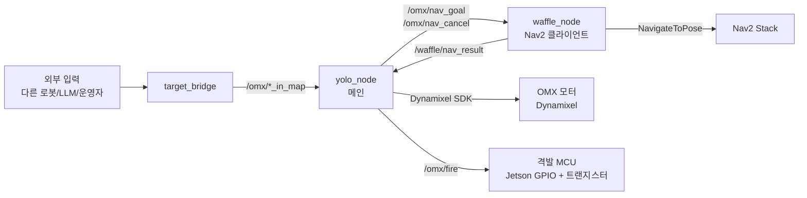
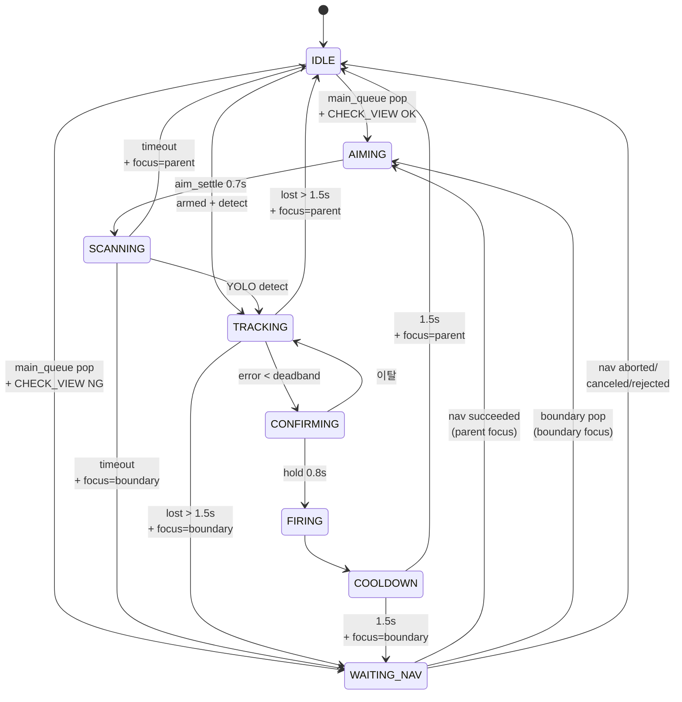

# OMX Auto-Aim System — INTERFACE v3

> Stage H3 기준. 다음 단계 (H4: BoundaryGenerator 통합) 진입 전 동결.
>
> 변경 이력:
> - v1 (Stage F): 큐 + LOS + TargetType
> - v2 (Stage H1): waffle_node 분리, Nav2 협력 추가
> - **v3 (Stage H3, 현재)**: 큐 분리, CHECK_VIEW/VIEW_POSE, WAITING_NAV, TARGET preempt

---

## 1. 시스템 개요

### 노드 구성



### 책임 분할

| 노드 | 책임 |
|---|---|
| **yolo_node** | YOLO 검출, OMX 모터 제어, 큐 관리, state machine, CHECK_VIEW/VIEW_POSE 계산, 격발 신호 |
| **waffle_node** | Nav2 NavigateToPose action 클라이언트 (thin adapter), goal/cancel 명령 처리, 결과 전달 |
| **target_bridge** | 외부 좌표 입력 → 적절한 토픽으로 전달 |
| **격발 MCU (예정)** | `/omx/fire` 신호 수신 → GPIO → 트랜지스터 → 발사 메커니즘 |

### 좌표계

| Frame | 의미 |
|---|---|
| `map` | 전역 좌표계 (Nav2/SLAM 기준) |
| `base_link` | 와플의 base 위치 |
| `arm_base` | OMX 의 shoulder_pan 회전 중심 (base_link 기준 offset: x=0.10, y=0, z=0.18) |

모든 외부 좌표 입력은 `map` frame. yolo_node 내부에서 `arm_base` 기준으로 변환해서 OMX 에 명령.

---

## 2. ROS Topics

### 2.1 yolo_node 의 Subscribers

| Topic | Type | 발행자 | 의미 |
|---|---|---|---|
| `/omx/target_in_map` | `geometry_msgs/PointStamped` | 외부 | TARGET 좌표 (priority=0, 최우선) |
| `/omx/boundary_in_map` | `geometry_msgs/PointStamped` | 외부 (H4: 내부 자동) | BOUNDARY 좌표 (priority=5) |
| `/omx/patrol_in_map` | `geometry_msgs/PointStamped` | 외부 | PATROL 좌표 (priority=10, 탐색용) |
| `/omx/control_mode` | `std_msgs/String` | 외부 | `"idle"` 시 abort + home |
| `/omx/arm_enable` | `std_msgs/Bool` | 외부 | autotrack 활성화 (큐 비었을 때 YOLO 자동 추적) |
| `/omx/abort` | `std_msgs/Empty` | 외부 | 긴급 정지 (모든 큐 비움 + IDLE + home) |
| `/global_costmap/costmap` | `nav_msgs/OccupancyGrid` | Nav2 | LOS 검사용 |
| `/waffle/nav_result` | `std_msgs/String` | waffle_node | Nav2 결과: `succeeded` / `aborted` / `canceled` / `rejected` |

### 2.2 yolo_node 의 Publishers

#### 외부 통신 (다른 노드/사람이 구독)

| Topic | Type | 발행 시점 | 의미 |
|---|---|---|---|
| `/omx/fire` | `std_msgs/Empty` | FIRING 진입 시 | **격발 신호 → MCU** |
| `/omx/target_processed` | `geometry_msgs/PointStamped` | 격발 후 | 좌표 처리 완료 (FIRE 함) |
| `/omx/target_lost` | `geometry_msgs/PointStamped` | TRACKING lost timeout | 추적 중 표적 사라짐 |
| `/omx/target_not_found` | `geometry_msgs/PointStamped` | SCANNING timeout (TARGET) | **TARGET 좌표에서 처음부터 못 발견** (H3 신규) |
| `/omx/target_blocked` | `geometry_msgs/PointStamped` | LOS BLOCKED 폐기 시 | 좌표가 장애물 뒤 |
| `/omx/patrol_complete` | `std_msgs/Empty` | main_queue 비었을 때 1회 | 정찰 완료 신호 |
| `/omx/nav_goal` | `geometry_msgs/PoseStamped` | WAITING_NAV 진입 시 | **waffle 에게 이동 목표** (VIEW_POSE) |
| `/omx/nav_cancel` | `std_msgs/Empty` | TARGET preempt 시 | **waffle 에게 cancel 요청** (H3 신규) |

#### 상태/디버그 (RViz, 모니터링)

| Topic | Type | 발행 빈도 | 의미 |
|---|---|---|---|
| `/omx/status` | `std_msgs/String` | 1 Hz | 상태 텍스트 (`dry_run_`, `paused_` 접두사 가능) |
| `/omx/state` | `std_msgs/String` | on change | state machine 의 state 이름 |
| `/omx/target_detected` | `std_msgs/Bool` | every tick | YOLO 검출 여부 |
| `/omx/error_norm` | `geometry_msgs/Point` | every tick | 영상 중심으로부터 정규화 오차 |
| `/omx/joint_state` | `sensor_msgs/JointState` | every tick | OMX 관절 위치 |
| `/omx/aim_progress` | `std_msgs/Float32` | every tick | CONFIRMING 진행도 (0.0~1.0) |
| `/omx/queue_size` | `std_msgs/Int32` | 1 Hz | main + boundary 큐 합계 |
| `/omx/queue_markers` | `visualization_msgs/MarkerArray` | 1 Hz | RViz 큐 시각화 |

### 2.3 waffle_node

| 방향 | Topic | Type | 의미 |
|---|---|---|---|
| Sub | `/omx/nav_goal` | `PoseStamped` | 이동 목표 수신 |
| Sub | `/omx/nav_cancel` | `Empty` | cancel 명령 수신 |
| Pub | `/waffle/nav_result` | `String` | Nav2 결과 (`succeeded`/`aborted`/`canceled`/`rejected`) |
| Pub | `/waffle/status` | `String` | 1 Hz status |
| Pub | `/waffle/state` | `String` | on change (`idle`/`navigating`) |
| Action Client | `/navigate_to_pose` | `nav2_msgs/NavigateToPose` | Nav2 액션 |

### 2.4 토픽 명명 규칙

- `/omx/*` — OMX (arm + 시스템 전체) 관련
- `/waffle/*` — waffle (mobile base) 관련
- `*_in_map` — 좌표 입력 (map frame 기준)
- 동사형 (`/omx/fire`, `/omx/abort`) — 명령
- 명사형 (`/omx/state`, `/omx/queue_size`) — 상태

---

## 3. State Machine

### 3.1 State 정의

| State | 의미 | 진입 조건 | 종료 조건 |
|---|---|---|---|
| `IDLE` | 대기. 다음 작업 pop 시도 | 처리 끝, abort | main_queue pop / autotrack detect |
| `WAITING_NAV` | 와플 이동 중 (Nav2 진행) | CHECK_VIEW NG 후 nav_goal 발행 | nav_result 수신 / preempt |
| `AIMING` | OMX 가 목표 각도로 이동 중 | 좌표 pop, view_pose 도착 | `aim_settle_sec` (0.7s) 경과 |
| `SCANNING` | 표적 발견 대기 | AIMING 종료 | YOLO detect / timeout |
| `TRACKING` | 표적 추적 (IBVS 보정) | SCANNING 중 detect | error<deadband / lost timeout |
| `CONFIRMING` | 격발 직전 조준 유지 검증 | TRACKING 에서 정렬됨 | hold_time (0.8s) / 이탈 |
| `FIRING` | 격발 신호 발행 | CONFIRMING hold 완료 | 즉시 |
| `COOLDOWN` | 격발 후 휴지 | FIRING | `cooldown_sec` (1.5s) |

### 3.2 전이 다이어그램



### 3.3 `current_parent` vs `current_focus`

H2 에서 도입된 핵심 개념 — 두 변수가 다를 수 있음:

- **`current_parent`**: 지금 처리 중인 TARGET 또는 PATROL (와플 이동의 최종 목적지)
- **`current_focus`**: 지금 OMX 가 *조준* 중인 entry (parent 또는 boundary)

흐름:
```
IDLE
  → main_queue pop (parent = PATROL/TARGET)
  → current_parent = entry, current_focus = entry → AIMING
  → ... → COOLDOWN → IDLE → 다음 parent
```

또는 (boundary 끼어들기):
```
WAITING_NAV (parent = PATROL, focus = None)
  → boundary_queue pop
  → current_focus = boundary entry → AIMING
  → ... → COOLDOWN
  → _on_focus_done: focus 가 boundary 였으니 WAITING_NAV 복귀
  → nav succeeded 시 current_focus = current_parent → AIMING
```

`_on_focus_done()` 의 판정 로직:
- `focus == parent` → IDLE (parent 처리 완료)
- `focus.type == BOUNDARY` → WAITING_NAV 복귀

### 3.4 `nav_pending_result` 처리 (H2.1 + H3.2)

waffle 의 nav_result 는 비동기 도착. 처리 정책:

1. **결과 도착** → `nav_pending_result` 에 저장
2. **update() 시작에서 검사**:
   - `pending_cancel_for_preempt = True` → 무시 (preempt 의 cancel 잔재)
   - `state == WAITING_NAV` → 적용 (`_handle_nav_result`)
   - 그 외 → 큐에 보관 (boundary 처리 중이면 끝나서 WAITING_NAV 복귀 시 처리)
3. **새 `nav_goal` 발행 시 자동 폐기** (H3.2): 옛 결과가 새 nav 에 잘못 매칭되는 race 방지

---

## 4. Queue Policy

### 4.1 큐 분리

| 큐 | 담는 type | 정렬 키 | 처리 시점 |
|---|---|---|---|
| **`main_queue`** | TARGET (priority 0), PATROL (priority 10) | (priority, distance, count) | IDLE 진입 시 pop |
| **`boundary_queue`** | BOUNDARY (priority 5) | (priority, distance, count) | WAITING_NAV 중 pop |

heapq 사용. priority 낮을수록 우선. 같은 priority 면 와플과 가까운 게 우선. 같은 거리면 먼저 들어온 게 우선 (FIFO).

### 4.2 중복 검사 (H3.1)

**같은 type 끼리만** 중복으로 간주. PATROL → TARGET 업그레이드 허용.

| 입력 type | 중복 비교 대상 |
|---|---|
| BOUNDARY | `boundary_queue` 의 BOUNDARY 끼리만 |
| PATROL | `last_processed` + `main_queue` 의 PATROL + `current_parent` (PATROL 인 경우) |
| TARGET | `main_queue` 의 TARGET + `current_parent` (TARGET 인 경우). `last_processed` 무시 (외부 신뢰 신호) |

거리 threshold: `patrol.duplicate_threshold_m` (기본 0.3m)

### 4.3 TARGET preempt (H3, H3.1)

TARGET 도착 시 흐름:

```
on_target(coord):
  1. _upgrade_patrol_in_queue_to_target(coord)
       └ main_queue 의 같은 위치 PATROL 항목 제거
  2. add_target(coord, TARGET)
       └ 중복 검사 후 main_queue 에 push
  3. _maybe_preempt_for_target(coord)
       └ current_parent 가 PATROL 인 경우 분기 처리
```

**Preempt 발동 조건** (`_preempt_ok`):
- `current_parent != None`
- `current_parent.type == PATROL`
- `state ∈ {WAITING_NAV, AIMING, SCANNING}`

**Preempt 제외 state** (PATROL 끝까지 처리):
- `TRACKING` — 이미 표적 발견, 실제 적일 가능성
- `CONFIRMING` — 격발 직전 (~0.8초 후 끝)
- `FIRING`, `COOLDOWN` — 격발 중 또는 직후

**Preempt 시 분기**:

| 위치 관계 | 동작 |
|---|---|
| **같은 위치** (PATROL = TARGET 좌표) | PATROL 폐기 (업그레이드 의미) |
| **다른 위치** | PATROL 을 `main_queue` 에 다시 push (priority 로 자동 재정렬) |

와플 이동 중 (`_is_waffle_navigating()`) 이면 `/omx/nav_cancel` 발행. 도착하는 cancel 결과는 `pending_cancel_for_preempt` flag 로 무시.

### 4.4 CHECK_VIEW

PATROL/TARGET 좌표를 *현 와플 위치에서* 조준 가능한가?

조건 3개 모두 통과 필요:
1. LOS = CLEAR 또는 UNKNOWN (BLOCKED 불가)
2. arm_base 기준 yaw 각도 ≤ `view_pose.omx_yaw_limit_deg` (기본 180°)
3. arm_base 기준 거리 ∈ `[min_distance_m, max_distance_m]` (기본 [0.3, 3.0]m)

OK → AIMING. NG → VIEW_POSE 계산 → WAITING_NAV.

### 4.5 VIEW_POSE v1 (H2)

target 으로부터 `stand_off_distance` (기본 1.0m) 만큼 와플 → target 직선상 떨어진 점.

```
ux, uy = (target - waffle).normalize()
vp_x   = target.x - stand_off * ux
vp_y   = target.y - stand_off * uy
```

**yaw 결정 (H2.1)**:
- `main_queue` 에 다음 entry 있으면 → 그 방향 (와플이 다음 작업으로 빨리 출발)
- 없으면 → 현재 target 방향 (fallback)

`view_pose.omx_yaw_limit_deg = 180.0` 으로 설정한 이유: 와플은 다음 방향 보고, OMX 가 ±180° 회전해서 현재 target 조준 가능하도록.

### 4.6 LOS Pop

큐 pop 시 LOS 검사 (`patrol.los_check_enabled = true` 일 때):

| LOS 결과 | PATROL/TARGET | BOUNDARY |
|---|---|---|
| CLEAR | 반환 | 반환 |
| UNKNOWN | 반환 | 폐기 (target_blocked 발행) |
| BLOCKED | 반환 | 폐기 (target_blocked 발행) |

PATROL/TARGET 은 LOS 불확실해도 일단 시도. BOUNDARY 는 부수적이므로 즉시 폐기.

### 4.7 BOUNDARY 폐기 정책

`boundary_queue` 일괄 clear 트리거:
- `nav_result = succeeded` (와플 도착) — 와플 위치가 바뀌어 옛 BOUNDARY 의미 없음
- `nav_result = aborted/canceled/rejected` — 어차피 처리 종료
- TARGET preempt — parent 폐기 시 함께 (H3)
- abort — 전체 클린업

---

## 5. Config Reference

`config.yaml` 의 모든 섹션. 기본값은 *현재 운영 중 권장값* 기준.

### 5.1 `motor`

```yaml
motor:
  port: /dev/ttyUSB0          # Dynamixel U2D2 포트
  profile_velocity: 50         # 모터 프로파일 속도
  profile_acceleration: 20     # 모터 프로파일 가속도
```

### 5.2 `calibration`

각 모터의 home tick 위치와 부호.

```yaml
calibration:
  home:
    shoulder_pan: 2048
    shoulder_lift: 2048
    elbow_flex: 2048
    wrist_flex: 2048
  sign:
    shoulder_pan: 1
    shoulder_lift: -1
    elbow_flex: 1
    wrist_flex: 1
```

> wrist_roll, gripper 는 H2 부터 물리적으로 제거됨 (격발은 외부 MCU). 항목 자체를 빼거나 무시 가능.

### 5.3 `safety`

```yaml
safety:
  angle_limits_deg:
    shoulder_pan:  [-180, 180]   # H2: VIEW_POSE 다음방향 정책 위해 ±180
    shoulder_lift: [-60,  60]
    elbow_flex:    [-90,  90]
    wrist_flex:    [-90,  90]
  max_step_deg: 2.0              # 한 tick 당 이동 한계
  large_delta_threshold_tick: 500
```

### 5.4 `ibvs` (Image-Based Visual Servoing)

```yaml
ibvs:
  camera_index: 0
  control_hz: 30                 # 메인 루프 주파수
  deadband: 0.05                 # 정렬 판정 임계 (영상 정규화 좌표)
  kp_yaw: 0.3
  kp_pitch: 0.3
  sign_vs_x: 1
  sign_vs_y: -1
```

### 5.5 `yolo`

```yaml
yolo:
  model_path: /home/lyw/omx_aim/models/best.pt
  target_class: 0                # 검출할 클래스 id
  conf_threshold: 0.5
  imgsz: 640
```

### 5.6 `fire`

격발 + 타이밍 관련.

```yaml
fire:
  hold_time_sec: 0.8             # CONFIRMING 유지 시간
  cooldown_sec: 1.5              # 격발 후 휴지
  lost_timeout_sec: 1.5          # TRACKING 중 표적 잃은 후 타임아웃
  confirm_deadband_scale: 0.5    # CONFIRMING 시 deadband 배율 (더 엄격)
  aim_settle_sec: 0.7            # H2.1: AIMING 대기 시간 (모터 이동 시간)
```

### 5.7 `autotrack`

```yaml
autotrack:
  default_armed: false           # 부팅 시 autotrack 활성화 여부
```

### 5.8 `patrol`

큐, LOS, scan 정책.

```yaml
patrol:
  scan_timeout_sec: 2.0          # PATROL/BOUNDARY 의 SCANNING 타임아웃
  target_scan_timeout_sec: 5.0   # H3: TARGET 의 더 긴 타임아웃
  duplicate_threshold_m: 0.3     # 중복 좌표 판정 거리
  los_check_enabled: true
  los_cost_threshold: 50         # 0~100 OccupancyGrid 값
  costmap_topic: /global_costmap/costmap
  publish_queue_markers: true    # RViz 마커 발행 여부
  max_queue_size: 20             # main_queue 최대 크기
```

### 5.9 `waffle` (H1)

```yaml
waffle:
  frame: map                     # nav_goal 의 frame
  nav_action_name: /navigate_to_pose
```

### 5.10 `view_pose` (H2)

CHECK_VIEW 판정 + VIEW_POSE 계산.

```yaml
view_pose:
  omx_yaw_limit_deg: 180.0       # CHECK_VIEW 의 yaw 한계
  min_distance_m: 0.3            # CHECK_VIEW 의 최소 거리
  max_distance_m: 3.0            # CHECK_VIEW 의 최대 거리
  stand_off_distance: 1.0        # VIEW_POSE 의 target 으로부터 거리
```

### 5.11 `boundary` (H2 정의, H4 활성화 예정)

```yaml
boundary:
  enable_during_target: false    # TARGET 처리 중 BOUNDARY 생성
  enable_during_patrol: true     # PATROL 처리 중 BOUNDARY 생성
  
  fan_half_angle_deg: 45.0       # 와플 heading 기준 ± 이 각도
  angle_step_deg: 22.5           # sweep step
  distance_m: 1.5                # 와플 → BOUNDARY 거리
  z: 0.3                         # BOUNDARY z 좌표
  
  period_sec: 1.0                # sweep 주기
  max_queue_size: 10             # boundary_queue 최대
  ttl_sec: 10.0                  # H4: 오래된 BOUNDARY 자동 만료
```

---

## 7. 운영 시나리오

검증된 동작들. 회귀 테스트 또는 시연 자료로 활용.

### 7.1 단순 PATROL — CHECK_VIEW OK

가까운 좌표 (현 위치에서 조준 가능):

```bash
ros2 topic pub /omx/patrol_in_map geometry_msgs/PointStamped \
  "{header: {frame_id: map}, point: {x: 1.0, y: 0.0, z: 0.3}}" --once
```

흐름: `IDLE → AIMING (0.7s) → SCANNING (2s) → IDLE`

### 7.2 PATROL — CHECK_VIEW NG (와플 이동 필요)

먼 좌표 또는 LOS BLOCKED:

```bash
ros2 topic pub /omx/patrol_in_map geometry_msgs/PointStamped \
  "{header: {frame_id: map}, point: {x: 5.0, y: 3.0, z: 0.3}}" --once
```

흐름: `IDLE → WAITING_NAV (Nav2 이동) → AIMING → SCANNING → IDLE`

기대 로그:
```
CHECK_VIEW NG: LOS BLOCKED (또는 yaw out / dist out)
[nav_goal] 발행
... 시간 흐름 ...
nav_result 받음: succeeded
와플 도착, parent AIMING
```

### 7.3 TARGET 업그레이드 — 같은 위치

PATROL 처리 중인 좌표에 TARGET 도착:

```bash
ros2 topic pub /omx/patrol_in_map geometry_msgs/PointStamped \
  "{header: {frame_id: map}, point: {x: 3.0, y: 1.0, z: 0.0}}" --once
sleep 1
ros2 topic pub /omx/target_in_map geometry_msgs/PointStamped \
  "{header: {frame_id: map}, point: {x: 3.0, y: 1.0, z: 0.0}}" --once
```

기대 로그:
```
=== TARGET preempt 발동 (state=waiting_nav, parent_loc=same) ===
[nav_cancel] 발행 (preempt)
PATROL → TARGET 업그레이드: (3.0, 1.0, 0.0) 폐기
... TARGET 처리 시작 ...
preempt cancel 결과 (canceled) 무시
```

scan_timeout 도 5초 (TARGET) 로 자동 적용.

### 7.4 TARGET preempt — 다른 위치, PATROL 큐 복귀

```bash
ros2 topic pub /omx/patrol_in_map geometry_msgs/PointStamped \
  "{header: {frame_id: map}, point: {x: 3.0, y: 0.0, z: 0.0}}" --once
sleep 1
ros2 topic pub /omx/target_in_map geometry_msgs/PointStamped \
  "{header: {frame_id: map}, point: {x: 1.0, y: -1.0, z: 0.3}}" --once
```

기대 로그:
```
=== TARGET preempt 발동 (state=..., parent_loc=different) ===
PATROL 큐 복귀: (3.0, 0.0, 0.0) (TARGET 처리 후 자동 재처리)
... TARGET 처리 ...
... TARGET 끝 → IDLE ...
main_queue pop: PATROL (3.0, 0.0, 0.0)    ← 복귀한 PATROL 자동 처리
```

### 7.5 TARGET miss (target_not_found)

표적 없는 좌표에 TARGET:

```bash
ros2 topic pub /omx/target_in_map geometry_msgs/PointStamped \
  "{header: {frame_id: map}, point: {x: 1.0, y: 0.0, z: 0.3}}" --once

ros2 topic echo /omx/target_not_found
```

기대: 5초 후 (`target_scan_timeout_sec`) `[target_not_found] 발행` + 토픽에 좌표 출력.

### 7.6 TRACKING 중 TARGET (preempt 안 함)

PATROL 처리하다 TRACKING 진입한 후 TARGET 발행:

기대: `TARGET preempt 발동` 로그 **안 찍힘**. TRACKING → CONFIRMING → FIRING → COOLDOWN → IDLE → TARGET pop. `_preempt_ok` 가 TRACKING state 를 제외하므로.

### 7.7 BOUNDARY (H2: 외부 입력만)

```bash
# WAITING_NAV 진입시킨 후
ros2 topic pub /omx/boundary_in_map geometry_msgs/PointStamped \
  "{header: {frame_id: map}, point: {x: 2.0, y: 1.0, z: 0.3}}" --once
```

기대: WAITING_NAV 중 boundary AIMING → SCANNING → COOLDOWN → WAITING_NAV 복귀. 와플 도착 시 `BOUNDARY 큐 N개 일괄 폐기`.

H4 에서는 sweep 자동 생성이 추가되어 외부 입력 없이도 발현. 외부 입력은 디버그용으로 유지.

### 7.8 abort 동작

```bash
ros2 topic pub /omx/abort std_msgs/Empty "{}" --once
```

기대: state → IDLE, 모든 큐 비움, OMX home 복귀, `nav_pending_result` 및 `pending_cancel_for_preempt` reset.

---

## 부록 A. 미구현 / 로드맵

| 단계 | 내용 | 상태 |
|---|---|---|
| H4 | BoundaryGenerator 자동 sweep, `/omx/boundary_enable` 토글 토픽, TTL | 다음 진행 |
| H5 | VIEW_POSE v2 — 8 방향 후보 샘플링 + cost 평가 | 미정 |
| H6 | 노드 분리 (queue_manager, view_pose_planner) | 미정 |
| — | 격발 MCU 펌웨어 (Jetson GPIO + 트랜지스터) | 외부 트랙 |
| — | LLM 명령 해석 | 외부 트랙 |
| — | 다중 로봇 협력 (Burger SLAM + 보급 로봇) | 외부 트랙 |

## 부록 B. 파일 구조 (Stage H3)

```
~/omx_aim/
├── config.yaml
├── omx/
│   ├── config.py        # dataclass 정의 + load_config
│   ├── hardware.py      # Dynamixel bus + 모터 관리
│   └── ...
├── apps/
│   ├── yolo_node.py     # 메인 노드 (~1900 줄)
│   ├── waffle_node.py   # Nav2 클라이언트
│   ├── target_bridge.py # 외부 좌표 입력
│   ├── keyboard_teleop.py
│   ├── aim_test.py
│   └── track_test.py
└── models/
    └── best.pt          # YOLO 학습 모델
```