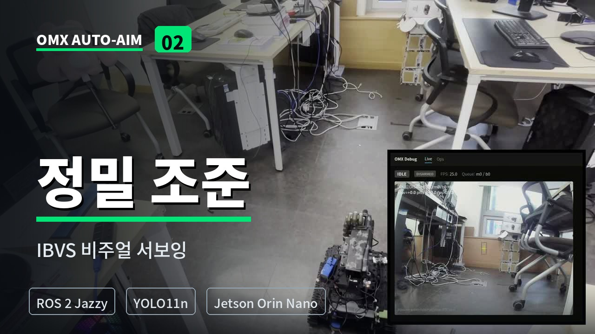

# OMX Auto-Aim Subsystem

<div align="center">

**Custom YOLO11n과 IBVS를 이용한  
OpenManipulator-X 자동 조준 및 안전 타격 시스템**

<br>


</div>

> [!NOTE]
> 이 저장소는  
> [ROS 2 Multi-Robot Autonomous Exploration & Response System](https://github.com/dladyddn133-creator/ROS2-Project)의  
> **Leader Waffle 자동 조준 및 타격 서브시스템**을 상세하게 정리한 저장소입니다.

---

## Demo

<div align="center">

[](https://youtu.be/t03m8PHifMo)

<br>

[▶ 전체 IBVS 자동 조준 및 타격 영상 보기](https://youtu.be/t03m8PHifMo)

</div>

> **Control flow:**  
> 위험 좌표 수신 → Point-at IK 개략 조준 → YOLO11n 표적 검출 →  
> IBVS PD 정밀 제어 → 안정성 확인 → GPIO 타격 → Home 복귀

---

## Overview

`OMX Auto-Aim`은 Leader Waffle에 장착된 OpenManipulator-X가  
지도상 위험 좌표를 전달받아 표적을 탐색하고, 영상 기반 제어를 통해 정밀하게 조준한 뒤 안전 조건을 확인하여 타격하는 ROS 2 서브시스템입니다.

지도 좌표를 이용한 **Point-at IK 개략 조준**과 카메라 영상을 이용한  
**YOLO11n + IBVS 정밀 조준**을 결합했습니다.

또한 긴급 표적 선점, 조준 위치 재탐색, Deadband 안정성 확인,  
Cooldown 및 타격 비활성화 기능을 상태 머신에 통합했습니다.

### Core Pipeline

```text
Target Coordinate in Map
        ↓
Target Priority Queue
        ↓
Nav2 Positioning / View Pose
        ↓
Point-at IK
        ↓
Custom YOLO11n Detection
        ↓
IBVS Pan / Tilt PD Control
        ↓
Target Stability Confirmation
        ↓
GPIO Firing
        ↓
Cooldown and Home Position

---

## 시스템 구성

```
[Burger]                        [Desktop]                    [Waffle (Jetson)]
SLAM + risk_map                 map_relay                    yolo_node
heartbeat + pose                auto_initialpose             waffle_node
       |                        scout_watchdog               fire_node
       +--/scout/map--------->  Nav2 + RViz                  target_bridge
       +--/risk/risk_map----->                               scan_processor
       +--/scout/heartbeat-->                                patrol_planner
                                     |                       turtlebot3_node
                                     +---/nav_goal--->       OMX motors
                                     <---/nav_result---      발사 메커니즘
```

## 기능

### 조준 파이프라인

1. **Point-at IK** — map 좌표를 OMX 관절 각도로 변환해 개략 조준
2. **YOLO 검출** — 조준 방향에서 표적 탐색
3. **IBVS 정밀 추적** — 화면 오차 기반 PD 제어로 표적을 중앙에 고정
4. **안전 확인** — deadband 안에서 일정 시간 유지되어야 격발

### 좌표 관리

- **3 종 우선순위 큐**: TARGET(0) / BOUNDARY(5) / PATROL(10)
- **8 상태 머신**: IDLE / WAITING_NAV / AIMING / SCANNING / TRACKING / CONFIRMING / FIRING / COOLDOWN
- **TARGET preempt**: 정찰 중 긴급 표적이 들어오면 진행 중인 작업을 밀어냄
- **자동 시야 확보**: 현 위치에서 조준 불가하면(CHECK_VIEW) 표적 주변 12 방향 후보를 cost 평가해(VIEW_POSE) Nav2 로 이동
- **사주 경계 sweep**: 이동 중 ±45° 방위를 순차적으로 둘러봄

### Burger 협력

- **map relay**: `/scout/map` → `/map` (Nav2 입력, latched)
- **patrol planner**: risk_map 의 hotspot 을 NMS 로 추출해 PATROL 좌표 발행
- **auto initial pose**: map 수신 시 AMCL 자동 초기화
- **scout watchdog**: Burger heartbeat 가 끊기면 마지막 위치 주변을 TARGET 으로 수색

### 격발

- **fire_node**: `/omx/fire` → GPIO 펄스 → 발사 메커니즘
- **안전 기능**: cooldown, `/omx/fire_disable` 잠금, 부팅/종료 시 LOW 보장
- 격발 펄스 동안 조준 자세를 유지한 뒤 home 복귀 (팔이 먼저 빠지지 않도록)

### 디버그 대시보드

`yolo_node` 안에서 Flask 스레드로 동작. 브라우저에서 실시간 영상 + 상태 확인.

- MJPEG 영상 스트림 + SSE 상태 push (Live / Ops 2탭)
- 헤드리스 SSH 환경에서 조준 상태를 눈으로 확인하기 위해 만들었다

---

## 빠른 시작

### 빌드

레포 자체가 colcon 워크스페이스이고, ROS 패키지는 `src/omx_aim/` 에 있다.

```bash
cd ~/omx_aim
colcon build --symlink-install   # config.yaml / launch 수정 후 재빌드 불필요
source install/setup.bash
```

> YOLO 가중치(`models/best.pt`)는 용량 문제로 저장소에 포함되지 않는다. 클론 후 `src/omx_aim/models/` 에 직접 배치할 것.

### 환경 alias

```bash
# Jetson
alias omxenv='source /opt/ros/jazzy/setup.bash && \
              source ~/venv/omx_ros/bin/activate && \
              source ~/omx_aim/install/setup.bash && \
              export ROS_DOMAIN_ID=20 && \
              cd ~/omx_aim'
```

### 실행 — Jetson 측

```bash
# 1. TurtleBot3 bringup
omxenv
export TURTLEBOT3_MODEL=waffle_pi
ros2 launch turtlebot3_bringup robot.launch.py
ros2 service call /motor_power std_srvs/srv/SetBool "{data: true}"

# 2. waffle_node + yolo_node + fire_node + target_bridge + scan_processor + patrol_planner
ros2 launch omx_aim jetson.launch.py

# 디버그 대시보드까지 켜기 → http://<jetson-ip>:8080/
ros2 launch omx_aim jetson.launch.py debug_stream:=true
ros2 launch omx_aim jetson.launch.py debug_stream:=true debug_port:=8090
```

### 실행 — Desktop 측

```bash
# 1. Nav2 (와플 켜진 후)
export TURTLEBOT3_MODEL=waffle_pi
ros2 launch nav2_bringup bringup_launch.py \
  map:=/tmp/nav2_dummy/dummy.yaml use_sim_time:=False

# 2. RViz
rviz2

# 3. 필요한 노드 개별 실행
ros2 run omx_aim map_relay          # /scout/map -> /map
ros2 run omx_aim auto_initialpose   # AMCL 초기화
ros2 run omx_aim scout_watchdog     # Burger 사망 감지
```

`desktop.launch.py` 는 위 세 노드가 주석 처리된 상태이며, 활성화된 것은 patrol_planner 뿐이다. patrol_planner 는 `jetson.launch.py` 에도 들어있으므로 **둘 중 한 곳에서만** 실행할 것.

### 시뮬 (Burger 없이)

```bash
ros2 launch omx_aim sim.launch.py   # fake_static_map + fake_risk_map
```

시뮬은 `/scout/risk_map` 으로 발행하므로 patrol_planner 쪽 토픽을 맞춰줘야 한다.

```bash
ros2 run omx_aim patrol_planner --ros-args -p risk_topic:=/scout/risk_map
```

### 좌표 발행

```bash
# TARGET (즉시 처리)
ros2 topic pub /omx/target_in_map geometry_msgs/PointStamped \
  "{header: {frame_id: map}, point: {x: 1.5, y: 0.5, z: 0.0}}" --once

# PATROL (정찰)
ros2 topic pub /omx/patrol_in_map geometry_msgs/PointStamped \
  "{header: {frame_id: map}, point: {x: 3.0, y: 1.0, z: 0.0}}" --once

# 자율 검출 ON (IDLE 상태에서 표적 보이면 자동 추적)
ros2 topic pub /omx/arm_enable std_msgs/Bool "{data: true}" --once

# 긴급 정지
ros2 topic pub /omx/abort std_msgs/Empty "{}" --once
ros2 topic pub /omx/fire_disable std_msgs/Bool "{data: true}" --once
```

RViz 의 `Publish Point`(P 키)로 맵을 클릭해도 TARGET 으로 들어간다.

---

## 토픽 요약

전체 목록과 타입은 [`INTERFACE.md`](INTERFACE.md) 참조.

**입력**
- `/scout/map`, `/risk/risk_map`, `/scout/heartbeat`, `/scout/pose` — Burger
- `/omx/target_in_map`, `/omx/patrol_in_map` — 좌표
- `/omx/abort`, `/omx/arm_enable`, `/omx/fire_disable`, `/omx/control_mode` — 제어

**출력**
- `/omx/fire` — 격발 신호 (fire_node 수신)
- `/omx/nav_goal`, `/omx/nav_cancel` — 와플 이동
- `/omx/state`, `/omx/status`, `/omx/queue_size` — 상태

## 시각화

RViz 에 추가할 토픽:

| 토픽 | 내용 |
|---|---|
| `/map` | Nav2 입력 맵 |
| `/risk/risk_map` | 위험도 히트맵 |
| `/global_costmap/costmap` | Nav2 cost map |
| `/patrol_planner/markers` | PATROL 후보 |
| `/scout_watchdog/markers` | 수색 후보 |
| `/omx/queue_markers` | 큐에 들어있는 좌표 |

## 진화 단계

| Stage | 내용 |
|---|---|
| A / D / F / G | 큐, LOS, 거리 정렬, RViz 시각화 |
| H1 | waffle_node 분리 |
| H2 | CHECK_VIEW + VIEW_POSE v1 + WAITING_NAV |
| H3 | TARGET preempt + miss 알림 |
| H4 | BoundaryGenerator sweep + TTL |
| H5 | VIEW_POSE v2 (12 후보 + cost 평가) |
| R1~R6 | 모듈 분리 (`omx/` 코어와 `omx_aim/` ROS 계층) |
| Burger 통합 | map_relay + patrol_planner + auto_initialpose + scout_watchdog |
| 격발 통합 | fire_node + GPIO + 안전 기능 |
| 운영 보정 | motor sign 보정, deadband 비대칭, 2D 운영, fire_pulse 도입 |
| 관측 | Flask 디버그 대시보드 (MJPEG + SSE) |

## 알려진 제약

종료 시점에 남아 있던 항목은 [`INTERFACE.md` 부록 B](INTERFACE.md) 에 정리했다. 주요한 것:

- patrol_planner 가 jetson / desktop launch 양쪽에 정의돼 있어 동시에 띄우면 중복 발행된다
- `desktop.launch.py` 는 patrol_planner 외에 전부 주석 처리된 상태다
- Nav2/AMCL 을 끄면 `map → odom` TF 가 끊겨 좌표 해석이 실패한다
- `shoulder_lift` 각도 한계 때문에 가깝고 높은 표적은 조준 범위를 벗어난다

## 문서

| 문서 | 내용 |
|---|---|
| [`INTERFACE.md`](INTERFACE.md) | 토픽 / 상태 머신 / 큐 정책 / 파라미터 계약 |
| [`SETUP.md`](SETUP.md) | 설치 · 하드웨어 셋업 · 트러블슈팅 |
| `config/config.yaml` | 모든 런타임 값의 단일 출처 |

## 의존성

```bash
sudo apt install \
  ros-jazzy-turtlebot3* \
  ros-jazzy-nav2-bringup \
  ros-jazzy-teleop-twist-keyboard \
  ros-jazzy-tf2-geometry-msgs

pip install ultralytics opencv-python flask dynamixel-sdk Jetson.GPIO
```

Jetson 환경은 패키지 버전 조합이 까다로워 `requirements.jetpack72.lock` 에 검증된 스냅샷을 남겨두었다. 자세한 절차는 [`SETUP.md`](SETUP.md) 참조.