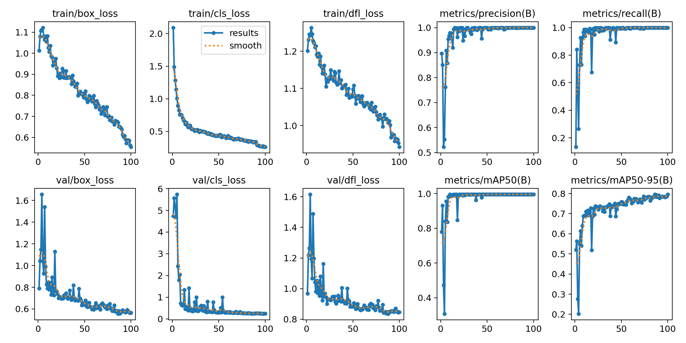

# OMX Auto-Aim Subsystem

<div align="center">

**Custom YOLO11n과 IBVS를 이용한  
OpenManipulator-X 자동 조준 및 안전 타격 시스템**

<br>


</div>

> [!NOTE]
> 이 저장소는
> [ROS 2 Multi-Robot Autonomous Exploration & Response System](https://github.com/dladyddn133-creator/ROS2-Project)의
> **Leader Waffle 자동 조준 및 타격 서브시스템**을 상세하게 정리한 저장소입니다.
>
> 원 프로젝트명: **CQB 전술 탐색·타격 로봇 시스템** (팀 탱크보이)

> [!IMPORTANT]
> **담당 범위** — 이 저장소의 코드는 전부 직접 구현했습니다.
> Custom YOLO11n 데이터셋 구축·라벨링·학습, Point-at IK 및 IBVS 조준 제어,
> 우선순위 큐와 상태 머신, GPIO 타격 제어, 정찰 로봇 연동 인터페이스 설계가 포함됩니다.
>
> 정찰 로봇(Active Scout)의 **SAC 자율 탐색 정책 · Cartographer SLAM · Bayesian Risk Map은 팀원이 담당**했으며,
> 이 저장소에는 해당 출력을 수신·해석하는 연동 계층만 포함되어 있습니다.

---

## Demo

<div align="center">

<!-- ▼ 여기에 hero_aim_fire.gif 드래그&드롭 (조준 → 수렴 → 격발 8초 루프) -->

<br>

[](https://youtu.be/t03m8PHifMo)

**[▶ IBVS 정밀 조준 및 타격 영상](https://youtu.be/t03m8PHifMo)** ·
[전체 시스템 데모](https://youtu.be/gJrPbyOyMIo) ·
[제한 공간 시연](https://youtu.be/vuF_W8wdSJ0)

</div>

> **Control flow:**
> 위험 좌표 수신 → Point-at IK 개략 조준 → YOLO11n 표적 검출 →
> IBVS PD 정밀 제어 → 안정성 확인 → GPIO 타격 → Home 복귀

---

## Overview

`OMX Auto-Aim`은 Leader Waffle에 장착된 OpenManipulator-X가 지도상 위험 좌표를 전달받아
표적을 탐색하고, 영상 기반 제어를 통해 정밀하게 조준한 뒤 안전 조건을 확인하여 타격하는 ROS 2 서브시스템입니다.

지도 좌표를 이용한 **Point-at IK 개략 조준**과 카메라 영상을 이용한
**YOLO11n + IBVS 정밀 조준**을 결합했습니다.

또한 긴급 표적 선점, 조준 위치 재탐색, Deadband 안정성 확인,
Cooldown 및 타격 비활성화 기능을 상태 머신에 통합했습니다.

### Core Pipeline

```text
Target Coordinate in Map
        ↓
Target Priority Queue
        ↓
Nav2 Positioning / View Pose
        ↓
Point-at IK
        ↓
Custom YOLO11n Detection
        ↓
IBVS Pan / Tilt PD Control
        ↓
Target Stability Confirmation
        ↓
GPIO Firing
        ↓
Cooldown and Home Position
```

---

## Custom YOLO11n Target Detector

프로젝트 전용 표적을 실시간으로 검출하기 위해 **데이터 수집, 프레임 추출, 라벨링,
모델 학습, 성능 검증 및 Jetson 배포까지 직접 수행**했습니다.

Jetson Orin Nano에서 실시간 추론 속도를 확보하기 위해 가장 경량인 nano 모델을 선택했습니다.

### Training Pipeline

1. 실제 로봇 운용 환경에서 표적 영상 촬영
2. 영상에서 학습용 이미지 프레임 추출
3. 표적 영역을 `target` 단일 클래스로 직접 라벨링
4. Train / Validation 데이터셋 분리
5. YOLO11n 모델을 100 epochs 학습
6. Validation 결과를 통해 최적 가중치 `best.pt` 선정
7. Jetson Orin Nano의 ROS 2 실시간 검출 노드에 모델 적용
8. 검출 박스 중심 좌표를 IBVS 제어 입력으로 사용

### Model Performance

| Metric | Validation Result |
|---|---:|
| Precision | ≈ 0.99 |
| Recall | ≈ 0.99 |
| mAP@0.5 | ≈ 0.99 |
| mAP@0.5:0.95 | ≈ 0.79 |
| Training Epochs | 100 |
| Model | YOLO11n |
| Classes | 1 (`target`) |

> 위 수치는 프로젝트 실험 환경에서 구성한 validation dataset 기준입니다.

### Training Results

<div align="center">



</div>

학습이 진행됨에 따라 Train/Validation Loss가 감소했고,
Precision, Recall 및 mAP@0.5가 안정적으로 수렴했습니다.

### Validation Predictions

<div align="center">


</div>

거리, 표적 크기, 촬영 각도 및 부분 가림 상태가 다른 Validation 이미지에서 표적을 검출한 결과입니다.

### Vision-to-Control Pipeline

```text
Camera Frame
    ↓
Custom YOLO11n Detection
    ↓
Bounding Box Center (cx, cy)
    ↓
Image Center Error (ex, ey)
    ↓
IBVS PD Controller
    ↓
OpenManipulator-X Pan / Tilt Control
    ↓
Target Alignment
    ↓
Safety Confirmation and Firing
```

---

## System Architecture

```text
[Active Scout · 팀원 담당]        [Desktop]                    [Leader Waffle · 담당]
SLAM + Risk Map                  map_relay                    yolo_node
Heartbeat + Pose                 auto_initialpose             waffle_node
       │                         scout_watchdog               fire_node
       ├──/scout/map──────────▶  Nav2 + RViz                  target_bridge
       ├──/risk/risk_map──────▶                               scan_processor
       └──/scout/heartbeat────▶        │                      patrol_planner
                                       │                      turtlebot3_node
                                       ├───/nav_goal──────▶   OMX motors
                                       ◀───/nav_result────    발사 메커니즘
```

---

## Key Features

### Aiming Pipeline

1. **Point-at IK** — 지도 좌표를 OMX 관절 각도로 변환하여 개략 조준을 수행합니다.
2. **YOLO Detection** — 조준 방향에서 표적을 탐색합니다.
3. **IBVS Precision Tracking** — 화면 중심 오차 기반 PD 제어로 표적을 중앙에 고정합니다.
4. **Safety Confirmation** — Deadband 내부에서 일정 시간 유지되어야 타격이 실행됩니다.

### Target Coordinate Management

- **3종 우선순위 큐** — TARGET(0) / BOUNDARY(5) / PATROL(10)
- **8단계 상태 머신** — IDLE / WAITING_NAV / AIMING / SCANNING / TRACKING / CONFIRMING / FIRING / COOLDOWN
- **TARGET Preempt** — 순찰 중 긴급 표적이 입력되면 진행 중인 작업을 선점합니다.
- **자동 시야 확보** — 현재 위치에서 조준이 불가능하면(CHECK_VIEW) 표적 주변 12방향 후보를 Cost 평가하여(VIEW_POSE) Nav2로 재이동합니다.
- **사주 경계 Sweep** — 이동 중 ±45° 방위를 순차적으로 관측합니다.

### Scout Integration

정찰 로봇이 생성한 데이터를 Leader가 사용할 수 있도록 변환하는 연동 계층입니다.

- **map_relay** — `/scout/map`을 Nav2 입력 지도 `/map`으로 전달합니다 (latched).
- **patrol_planner** — Risk Map의 Hotspot을 NMS로 추출하여 PATROL 좌표를 발행합니다.
- **auto_initialpose** — 지도 수신 시 AMCL을 자동으로 초기화합니다.
- **scout_watchdog** — Scout heartbeat가 두절되면 마지막 위치 주변을 TARGET으로 수색합니다.

### Firing Control

- **fire_node** — `/omx/fire` 수신 시 GPIO 펄스를 출력하여 발사 메커니즘을 구동합니다.
- **안전 기능** — Cooldown, `/omx/fire_disable` 잠금, 부팅 및 종료 시 출력 LOW 보장
- 타격 펄스가 유지되는 동안 조준 자세를 유지한 뒤 Home으로 복귀합니다.

### Debug Dashboard

`yolo_node` 내부에서 Flask 스레드로 동작하며, 브라우저에서 실시간 영상과 상태를 확인할 수 있습니다.

- MJPEG 영상 스트림과 SSE 상태 push (Live / Ops 2탭)
- 헤드리스 SSH 환경에서 조준 상태를 시각적으로 검증하기 위해 구현했습니다.

---

## Tech Stack

| Category | Technologies |
|---|---|
| **Robotics** | ROS 2 Jazzy, TurtleBot3 Waffle, OpenManipulator-X |
| **Vision AI** | Custom YOLO11n, Ultralytics, OpenCV, PyTorch |
| **Control** | IBVS, PD Control, Point-at IK, State Machine |
| **Navigation** | Nav2, AMCL, TF2 |
| **Embedded** | Jetson Orin Nano, Jetson.GPIO, Dynamixel |
| **Communication** | ROS 2 Topics, DDS, ROS_DOMAIN_ID |
| **Monitoring** | Flask, MJPEG, SSE |
| **Language / Tools** | Python, Linux, Git, GitHub |

---

## Repository Structure

```text
omx_aim/
├── README.md
├── INTERFACE.md
├── SETUP.md
├── requirements.jetpack72.lock
├── docs/
│   └── media/
└── src/
    └── omx_aim/
        ├── config/config.yaml
        ├── launch/
        │   ├── jetson.launch.py
        │   ├── desktop.launch.py
        │   └── sim.launch.py
        ├── models/best.pt
        ├── omx/                     # 프레임워크 비의존 코어 로직
        │   ├── priority queue
        │   ├── state machine
        │   ├── Point-at IK
        │   └── IBVS control
        ├── omx_aim/                 # ROS 2 노드 계층
        │   ├── waffle_node
        │   ├── yolo_node
        │   ├── fire_node
        │   ├── target_bridge
        │   ├── scan_processor
        │   └── patrol_planner
        ├── package.xml
        └── setup.py
```

### Main Components

| Component | Role |
|---|---|
| `waffle_node` | 좌표 작업 큐와 전체 자동 조준 상태 머신 관리 |
| `yolo_node` | 카메라 입력, YOLO11n 추론 및 표적 중심 좌표 계산 |
| `target_bridge` | 지도상의 표적 좌표를 OMX 작업으로 변환 |
| `scan_processor` | LiDAR 및 주변 장애물 정보를 이용한 시야 판단 |
| `patrol_planner` | Risk Map에서 순찰 후보 위치 생성 |
| `fire_node` | GPIO 타격 펄스 출력과 안전 잠금 처리 |
| `map_relay` | Scout 지도를 Leader의 Nav2 입력 지도로 전달 |
| `scout_watchdog` | Scout heartbeat 감시 및 장애 발생 시 수색 좌표 생성 |

> YOLO 가중치 `best.pt`는 용량 문제로 저장소에 포함하지 않으며,
> 실행 시 `src/omx_aim/models/` 경로에 별도로 배치해야 합니다.

---

## Build and Run

저장소 자체가 colcon 워크스페이스이며, ROS 2 패키지는 `src/omx_aim/`에 위치합니다.

### Build

```bash
cd ~/omx_aim
source /opt/ros/jazzy/setup.bash

colcon build --symlink-install
source install/setup.bash
```

### Jetson — Leader Waffle

```bash
export TURTLEBOT3_MODEL=waffle_pi

# 1. TurtleBot3 bringup
ros2 launch turtlebot3_bringup robot.launch.py
ros2 service call /motor_power std_srvs/srv/SetBool "{data: true}"

# 2. OMX Auto-Aim 노드 실행
ros2 launch omx_aim jetson.launch.py

# 디버그 대시보드 포함 → http://<jetson-ip>:8080/
ros2 launch omx_aim jetson.launch.py debug_stream:=true
```

### Desktop — Navigation and Visualization

```bash
export TURTLEBOT3_MODEL=waffle_pi

ros2 launch nav2_bringup bringup_launch.py \
  map:=/tmp/nav2_dummy/dummy.yaml use_sim_time:=False

rviz2
```

### Simulation — Scout 없이 단독 실행

```bash
ros2 launch omx_aim sim.launch.py
```

<details>
<summary><strong>환경 alias, 개별 노드 실행 및 좌표 수동 발행 펼쳐보기</strong></summary>

<br>

### 환경 alias

```bash
alias omxenv='source /opt/ros/jazzy/setup.bash && \
              source ~/venv/omx_ros/bin/activate && \
              source ~/omx_aim/install/setup.bash && \
              export ROS_DOMAIN_ID=20 && \
              cd ~/omx_aim'
```

### Desktop 노드 개별 실행

```bash
ros2 run omx_aim map_relay          # /scout/map → /map
ros2 run omx_aim auto_initialpose   # AMCL 초기화
ros2 run omx_aim scout_watchdog     # Scout 장애 감지
```

`desktop.launch.py`에서는 위 세 노드가 비활성화되어 있으며 `patrol_planner`만 활성화되어 있습니다.
`patrol_planner`는 `jetson.launch.py`에도 포함되어 있으므로 **한쪽에서만** 실행해야 합니다.

### 시뮬레이션 토픽 정합

시뮬레이션은 `/scout/risk_map`으로 발행하므로 `patrol_planner`의 토픽을 맞춰야 합니다.

```bash
ros2 run omx_aim patrol_planner --ros-args -p risk_topic:=/scout/risk_map
```

### 좌표 수동 발행

```bash
# TARGET (즉시 처리)
ros2 topic pub /omx/target_in_map geometry_msgs/PointStamped \
  "{header: {frame_id: map}, point: {x: 1.5, y: 0.5, z: 0.0}}" --once

# PATROL (순찰)
ros2 topic pub /omx/patrol_in_map geometry_msgs/PointStamped \
  "{header: {frame_id: map}, point: {x: 3.0, y: 1.0, z: 0.0}}" --once

# 자율 검출 활성화
ros2 topic pub /omx/arm_enable std_msgs/Bool "{data: true}" --once

# 긴급 정지
ros2 topic pub /omx/abort std_msgs/Empty "{}" --once
ros2 topic pub /omx/fire_disable std_msgs/Bool "{data: true}" --once
```

RViz의 `Publish Point`(P 키)로 지도를 클릭해도 TARGET으로 입력됩니다.

</details>

> 상세한 설치 절차와 트러블슈팅은 [`SETUP.md`](SETUP.md)를 참고하세요.

---

## ROS 2 Interfaces and Visualization

<details>
<summary><strong>주요 토픽 및 RViz 시각화 정보 펼쳐보기</strong></summary>

<br>

전체 토픽 목록, 메시지 타입 및 인터페이스 계약은
[`INTERFACE.md`](INTERFACE.md)를 참고하세요.

### Input Topics

| Topic | Description |
|---|---|
| `/scout/map` | Active Scout가 생성한 SLAM 지도 |
| `/risk/risk_map` | 객체 검출 결과를 누적한 위험 지도 |
| `/scout/heartbeat` | Active Scout 동작 상태 |
| `/scout/pose` | Active Scout의 현재 위치 |
| `/omx/target_in_map` | 즉시 대응할 표적 좌표 |
| `/omx/patrol_in_map` | 순찰 대상 좌표 |
| `/omx/abort` | 현재 조준 및 이동 작업 긴급 중단 |
| `/omx/arm_enable` | 자동 표적 검출 및 조준 활성화 |
| `/omx/fire_disable` | 타격 장치 비활성화 |
| `/omx/control_mode` | OMX 제어 모드 변경 |

### Output Topics

| Topic | Description |
|---|---|
| `/omx/fire` | `fire_node`로 전달되는 타격 신호 |
| `/omx/nav_goal` | Leader Waffle의 Nav2 이동 목표 |
| `/omx/nav_cancel` | 진행 중인 Nav2 이동 취소 |
| `/omx/state` | 자동 조준 상태 머신의 현재 상태 |
| `/omx/status` | OMX 서브시스템 동작 상태 |
| `/omx/queue_size` | 대기 중인 좌표 작업 수 |

### RViz Visualization

| Topic | Description |
|---|---|
| `/map` | Nav2 입력 지도 |
| `/risk/risk_map` | 위험도 히트맵 |
| `/global_costmap/costmap` | Nav2 Global Costmap |
| `/patrol_planner/markers` | 순찰 후보 위치 |
| `/scout_watchdog/markers` | Scout 장애 발생 시 수색 후보 |
| `/omx/queue_markers` | 우선순위 큐에 등록된 좌표 |

</details>

---

## Engineering Evolution

프로젝트를 실제 로봇에 적용하면서 발생한 문제를 분석하고,
제어 구조와 소프트웨어 아키텍처를 단계적으로 개선했습니다.

| Problem | Improvement | Result |
|---|---|---|
| 하나의 노드에 이동·조준·타격 로직이 집중됨 | `waffle_node`와 OMX 제어 모듈을 분리 | 이동 제어와 로봇팔 제어의 책임 분리 |
| 현재 위치에서 로봇팔이 표적을 볼 수 없는 상황 발생 | `CHECK_VIEW`와 `VIEW_POSE` 상태 추가 | 조준 가능한 위치로 자동 재이동 |
| 단일 View Pose만으로는 장애물과 Costmap 대응이 어려움 | 표적 주변 12개 후보 위치 생성 및 Cost 평가 | 이동 가능한 조준 위치를 자동 선택 |
| 순찰 중 긴급 표적이 입력되면 대응이 지연됨 | TARGET 우선순위와 작업 선점 기능 적용 | 진행 중인 PATROL 작업을 중단하고 표적 우선 대응 |
| 실제 OMX 관절 방향과 계산 결과가 일치하지 않음 | 관절별 Motor Sign과 조준 방향 보정 | 실물 로봇 기준 Pan/Tilt 제어 안정화 |
| 화면 중심 기준 Deadband가 좌우·상하에서 동일하게 동작하지 않음 | 비대칭 Deadband와 PD Gain 개별 튜닝 | 표적 중심 정렬 시 진동과 과도 응답 감소 |
| 타격 신호 발생 직후 로봇팔이 먼저 Home으로 복귀함 | 타격 Pulse 동안 조준 자세 유지 | 타격 동작 완료 후 안전하게 Home 복귀 |
| SSH 환경에서 카메라와 상태 확인이 어려움 | Flask MJPEG 및 SSE 대시보드 구현 | 원격 환경에서 영상과 상태 머신 실시간 확인 |

### Architecture Refactoring

초기에는 ROS 2 노드와 제어 알고리즘이 강하게 결합되어 있었지만,
개발 과정에서 다음과 같이 구조를 분리했습니다.

```text
ROS 2 Interface Layer
    ├── Topic Subscription / Publication
    ├── TF and Coordinate Conversion
    ├── Nav2 Integration
    └── Hardware Interface
                ↓
OMX Core Logic
    ├── Priority Queue
    ├── State Machine
    ├── Point-at IK
    ├── IBVS PD Control
    └── Safety Conditions
```

이를 통해 ROS 2 통신 로직과 조준 알고리즘을 분리하고,
상태 머신과 제어 로직을 독립적으로 수정하고 검증할 수 있도록 구성했습니다.

---

## Known Limitations

실물 로봇 시스템 특성상 다음과 같은 제약이 남아 있습니다.

| Limitation | Cause and Consideration |
|---|---|
| `patrol_planner` 중복 실행 가능성 | Jetson과 Desktop Launch에서 동시에 실행하면 동일 좌표가 중복 발행될 수 있으므로 한쪽에서만 실행해야 함 |
| Desktop Launch 일부 노드 수동 실행 필요 | `desktop.launch.py`에서 일부 노드가 비활성화되어 있어 실행 구성을 확인해야 함 |
| Nav2 또는 AMCL 종료 시 좌표 변환 실패 | `map → odom` TF가 사라지면 지도 좌표 기반 조준과 이동을 수행할 수 없음 |
| 가깝고 높은 표적의 조준 범위 제한 | OpenManipulator-X의 `shoulder_lift` 관절 한계로 일부 좌표는 도달 불가능 |
| YOLO 모델의 환경 의존성 | 프로젝트 실험 환경에서 수집한 단일 표적 데이터로 학습되어 새로운 배경과 조명에서는 추가 학습이 필요할 수 있음 |
| 네트워크 상태에 따른 영상 지연 | Flask MJPEG 스트리밍과 ROS 2 토픽을 동시에 사용할 경우 Wi-Fi 대역폭의 영향을 받을 수 있음 |

> 전체 인터페이스 제약과 세부 구현 내용은
> [`INTERFACE.md`](INTERFACE.md)의 부록을 참고하세요.

---

## Documentation

| Document | Description |
|---|---|
| [`INTERFACE.md`](INTERFACE.md) | ROS 2 토픽, 상태 머신, 우선순위 큐 및 파라미터 계약 |
| [`SETUP.md`](SETUP.md) | 설치, Jetson 환경 구성, 하드웨어 설정 및 트러블슈팅 |
| [`config/config.yaml`](src/omx_aim/config/config.yaml) | 조준, IBVS, 상태 머신 및 안전 기능의 런타임 설정 |
| [`requirements.jetpack72.lock`](requirements.jetpack72.lock) | JetPack 7.2 환경에서 검증한 Python 패키지 버전 |

---

## Dependencies

<details>
<summary><strong>ROS 2 및 Python 의존성 펼쳐보기</strong></summary>

<br>

### ROS 2 Packages

```bash
sudo apt install \
  ros-jazzy-turtlebot3* \
  ros-jazzy-nav2-bringup \
  ros-jazzy-teleop-twist-keyboard \
  ros-jazzy-tf2-geometry-msgs
```

### Python Packages

```bash
pip install \
  ultralytics \
  opencv-python \
  flask \
  dynamixel-sdk \
  Jetson.GPIO
```

Jetson 환경은 CUDA, PyTorch 및 Ultralytics의 버전 조합에 영향을 받습니다.
프로젝트에서 검증한 패키지 조합은 `requirements.jetpack72.lock`에 저장했습니다.

자세한 설치 절차와 문제 해결 방법은 [`SETUP.md`](SETUP.md)를 참고하세요.

</details>

---

## Related Project

### [ROS 2 Multi-Robot Autonomous Exploration & Response System](https://github.com/dladyddn133-creator/ROS2-Project)

이 저장소의 OMX 자동 조준 시스템이 포함된 전체 다중 로봇 프로젝트입니다.

- SAC 기반 Active Scout 자율 탐색 *(팀원 담당)*
- Cartographer SLAM 및 Bayesian Risk Map *(팀원 담당)*
- ROS 2 Multi-Domain 통신 및 Domain Bridge
- Leader Waffle의 Nav2 자율 이동
- Custom YOLO11n 기반 표적 검출
- IBVS 기반 OpenManipulator-X 자동 조준 및 타격
- Scout 장애 감지와 Follower 임무 인계
- 통합 웹 대시보드

---

## Project Status

- OpenManipulator-X 자동 조준 및 타격 파이프라인 구현 완료
- Custom YOLO11n 모델의 Jetson Orin Nano 실시간 적용 완료
- Point-at IK 및 IBVS Pan/Tilt 제어 구현 완료
- GPIO 타격 장치와 안전 상태 머신 통합 완료
- Leader Waffle 실물 로봇 통합 테스트 및 데모 완료
- 최종 구현은 커밋 `4810692`를 기준으로 보존하고 있습니다.

---

## License

MIT License — 자세한 내용은 [`LICENSE`](LICENSE)를 참고하세요.

---

<div align="center">

[⬆ Back to Top](#omx-auto-aim-subsystem) ·
[전체 다중 로봇 프로젝트 보기](https://github.com/dladyddn133-creator/ROS2-Project)

</div>